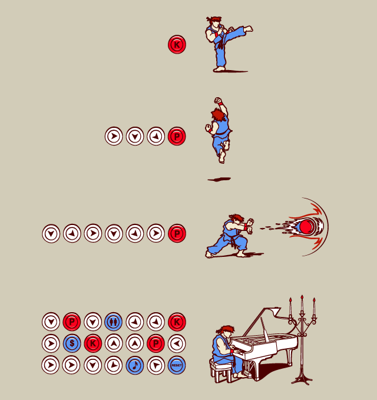

# Libraries and Data
  
```{r Libraries, eval=T,echo=T, warning=F, message=F}

#If you downloaded tidyverse
#install.packages('tidyverse')
#library(tidyverse)

#install.packages('dplyr')
library(dplyr) 

#install.packages('tidyr')
library(tidyr) 

#install.packages('ggplot2')
library(ggplot2)

Alaska <- read.csv("./Data/Alaska.csv") #Sea around Us data for Alaska
USA <- read.csv("./Data/USAP.csv") #Sea around Us data for USA


```

# Data Manipulation with Dplyr and Tidyr

Despite being separate, these two packages work together as one. Their main function is to manipulate data frames and keep things "tydi". In some cases you can also make basic data creation. Both packages follow the same syntax and can use the pipe operator, I normally don't even know which function is from what package so I often just call both.

Plus: Most functions are self explanatory like `select` or `filter`! 

## Dplyr

### Arrange
The `arrange`function allows you to, literally, arrange your data by any value of a column

#### Basic structure:

New_Table <- arrange(Data, column_to_arrange_by)

*Note:* If you want to do from Top <- Bottom you can use `desc()` within the function

*Note:* when doing multiple variables the order is important since it will start with the first one

```{r Dplyr, echo =T, eval=T}

#You can arrange by characters (A -> Z)
Arrange_Example <- arrange(Alaska,common_name)

head(Arrange_Example[5:7], 3)

#You can arrange by characters (A <- Z) using desc()
Arrange_Example2 <- arrange(Alaska,desc(common_name))


head(Arrange_Example2[5:7], 3)

# you can do multiple characters:
Arrange_Example3 <- arrange(Alaska,common_name,functional_group, desc(commercial_group))

head(Arrange_Example3[7:9],3)

# And naturally, you can also arrange by numeric factors

Arrange_Example4 <- arrange(Alaska, uncertainty_score, desc(tonnes))

head(Arrange_Example4[4:6],3)


```

### Filter
The `filter` function allows you to, literally, filter your data by any category or number.

#### Basic structure:

New_Table <- filter(Data, column_to_filter_by == "category")

`filter` operators:

- `a == b`	`a` is equal to `b`
- `a != b`	`a` is not equal to `b`
- `a > b`	  `a` is greater than `b`
- `a < b`	  `a` is less than `b`
- `a >= b`	`a` is greater than or equal to `b`
- `a <= b`	`a` is less than or equal to `b`
- `a %in% b`	`a` is an element in `b`  


```{r Filter, echo =T, eval=T}

#You can filter by character
Filter_Example <- filter(Alaska, 
                         common_name =="Clams")

head(Filter_Example[1:5], 5)

#You can filter by numeric inputs too
Filter_Example2 <- filter(Alaska,
                         year == 2009)
head(Filter_Example2[1:5], 5)

# Note: you can do =>, <= or !=

# you can do multiple characters:

Selection <- c("Clams","Octopuses")

Filter_Example3 <- filter(Alaska,
                          common_name %in% Selection)

head(Filter_Example3[4:8], 5)

# NOTE: remember that in R there are multiple ways to get to the same result! 

#Wait! What if I want to filter by multiple columns!? 

Filter_Example4 <- filter(Alaska,common_name == "Clams",
                            reporting_status =="Unreported") #Will give me all clams 
# that are unreported

#You can also filter by NA

Filter_NA_Example1 <- filter(Alaska,is.na(uncertainty_score)) #Extract only NA's

head(Filter_NA_Example1[1:4],3)

Filter_NA_Example2 <- filter(Alaska,!is.na(uncertainty_score)) #Clear NA's

```


### Group_by* (plus summarise)
The `group_by`function allows you to group your data by common variables for future (immediate) calculations. This function needs the "pipe operator"

#### Basic structure:

New_Table <- Data %>% 
  group_by(column_1,column_2...) %>% 
  second_function()

```{r Group_by, echo =T, eval=T}

#Simple group_by
Group_by_Example <- Alaska %>% 
  group_by(common_name) %>% 
  summarise(n()) #tells you how many rows of each "common_name"" you have

head(Group_by_Example, 3)

#Multiple
Group_by_Example2 <- Alaska %>% 
  group_by(common_name,uncertainty_score) %>% 
  summarise(n()) %>% #tells you how many rows of each "common_name"" you have
  arrange(uncertainty_score)

head(Group_by_Example, 3)
```

### Mutate
The `mutate` function allows you to create a new column in the data-set. The new column can have characters or numbers.

#### Basic structure:

New_Table <- mutate(Data, Name_New_Column = action)

```{r mutate, echo =T, eval=T}

#Functions
Mutate_Example1 <- mutate(Alaska, Log = log(tonnes))

head(Mutate_Example1[13:16], 3)

#In data calculations (per row)
Mutate_Example2 <- mutate(Alaska, Price_plus_Ton = (landed_value+tonnes))

head(Mutate_Example2[13:16], 3)

#Or characters...
Mutate_Example3 <- mutate(Alaska, Country = "USA")

head(Mutate_Example3[13:16], 3)

Mutate_Example4 <- mutate(Mutate_Example3, Country = paste("In",year,Country,"harvested",
                                                           round(tonnes,2), "tonnes of", common_name))

paste(Mutate_Example4[1,16])
paste(Mutate_Example4[5387,16])

```

### Rename
The `rename` function is another "self explanatory" it allows you to rename the columns

#### Basic structure:

New_Table <- rename(Data,New_Name = Old_Name)

```{r rename, echo =T, eval=T}

Rename_Example <- rename(Alaska, Weight = tonnes)

```


### Select
The `select`function is one of those "of-course it does that" function cus it allows you to, wait for it... SELECT any column you want.

#### Basic structure:

New_Table <- select(Data,number or name of column)

**Note:** Re-ordering of values happens here!

```{r select, echo =T, eval=T}

#Select by column number
Select_Example1 <- select(Alaska, 6)

head(Select_Example1,3)

#Select by multiple column numbers
Select_Example2 <- select(Alaska, 4,5,6,7)

head(Select_Example2, 3)

# You can also do (4:7) and even (4:6,15)

#Select by name
Select_Example3 <- select(Alaska, area_name,year,scientific_name,tonnes)

head(Select_Example3, 3)

# You can drop columns from a dataframe

Select_Example4 <- select(Select_Example3, -area_name,year)

head(Select_Example4, 3)

#Note, you can also drop using -

#And you can also re-order your columns!

Select_Example5 <- select(Select_Example3, scientific_name,year,tonnes,area_name)

head(Select_Example5, 3)

#And you don't have to write everything

Select_Example6 <- select(Select_Example5, scientific_name,
                          everything())

head(Select_Example5, 3)

```

###slice
The `slice`function works like the `select`function but for rows. So, if you want to extract an specific row, a set of rows, or a range between values, use slice!

#### Basic Structure 

New_Data <- slice(Old_Data, number)

```{r slice, echo =T, eval=T}

#Select by row number
Slice_Example1 <- slice(Alaska, 3948)

Slice_Example1

#Select by multiple rows
Slice_Example2 <- slice(Alaska, 1000:3948)

head(Slice_Example2, 3)

```


## Joining Data with dplyr


### The "bind" family
These functions will help us bind two or more data-sets in one depending on different variables.

#### bind_cols

The `bind_cols` function allows us to bind two data-sets by column.

##### Basic Structure 

New_Data <- bind_cols(Data1, Data2)


```{r bind_cols, echo =T, eval=T}

#Lets just asume that we have two different data sets
Data1 <- select(Alaska, 1)
Data2 <- select(Alaska, 2)

# View(Data2)


#Now we bind the columns together
Bind_Cols_1 <- bind_cols(Data1,Data2)

head(Bind_Cols_1, 3)
```

#### bind_rows

The `bind_rows` function is a sister-function of bind_cols but for binding rows.

##### Basic Structure 

New_Data <- bind_rows(Data1, Data2)

```{r bind_rows, echo =T, eval=T}

#Lets just assume that we have two different data sets
Data1 <- slice(Alaska, 1:3)
Data2 <- slice(Alaska, 10800:10802)

#Now we bind the columns together
Bind_Row_1 <- bind_cols(Data1,Data2)

head(Bind_Row_1, 6)
```

### The "join" family

#### anti_join
This function will allow you to select all variables that are **not** the same within two data-sets. Note, both data-sets must have at least one similar category/column.

##### Basic Structure 

Data_Name <- anti_join(Dataset1,Dataset2, by="similar category")

Lets us know what variables from one data-set are not present in some other data-set

```{r anti_join, echo =T, eval=T}


#Lets asume we want to know how many species are fished in Alaska 
#and not in the continental US
Diff_Species <- anti_join(Alaska, USA, by="scientific_name")

#Lets assume we want to know how many species are fished in Alaska 
#and not in the continental US
Similar_Species <- anti_join(Alaska, USA, by="scientific_name")


#You can also do it by more than one variable
Diff_Species2 <- anti_join(Alaska, USA, by=c("scientific_name","reporting_status"))

```

#### semi_join
This function does the opposite as the anti join, letting you select those variables shared by two data-sets.

##### Basic Structure 

Data_Name <- semi_join(Dataset1, Dataset2, by="similar category")

```{r semi_join, echo =T, eval=T}
#Now we want to know how many species are fished in BOTH Alaska and the continental US
Same_Species <- semi_join(Alaska, USA, by="scientific_name")

#Note: just like anti_join, you can do it for more than one variable

```

#### Inner_join

`Inner_join` will let you combine variables (rows) from different data-sets into one data-set based on a category/column that you choose

##### Basic Structure 

Data_Name <- inner_join(Dataset1, Dataset2, by="similar category")

```{r Inner_join, echo =T, eval=T}
#Now we want to know how many species are fished in BOTH Alaska and the continental US
Inner_Species <- inner_join(Alaska, USA, by="scientific_name")

#Note: just like anti_join, you can do it for more than one variable

#Lets just asume that we have two different data sets
Data1 <- select(Alaska, 7,8)
Data2 <- select(Alaska, 7,11)

#Both Data 1 have two columns from witch one is "common_name".
# In the case of Data 1 the second column is "functional_group" and in the case of Data2 its "fishing_sector"

Inner_Example <- inner_join(Data1, Data2, by="common_name")

# The result will be a data-set with the "common_name",
# "functional_group" and "fishing_sector"

head(Inner_Example,3)

```


#### Left_join

##### Basic Structure 

Data_Name <- left_join(Dataset1, Dataset2, by="similar category")

```{r Left_join, echo =T, eval=T}
#Now we want to know how many species are fished in BOTH Alaska and the continental US
Left_Species <- left_join(Alaska, USA, by="scientific_name")

#Note: just like anti_join, you can do it for more than one variable

```

#### Right_join

##### Basic Structure 

Data_Name <- right_join(Dataset1, Dataset2, by="similar category")

```{r right_join, echo =T, eval=T}
#Now we want to know how many species are fished in BOTH Alaska and the continental US
Right_Species <- right_join(Alaska, USA, by="scientific_name")

#Note: just like anti_join, you can do it for more than one variable

```


## Tidyr

### Gather and Spread
The `gather` function allows us to convert long data to short format. This is specifically helpful for plotting since it will allow you to set categories to data.

Note: The `spread` function is exactly the opposite to `gather` and has the same structure

##### Basic Structure 

Data_Name <- gather(Dataset, key ="Some_Name", value ="Other_name", x:x)


```{r gather, echo=t, eval=T}

# For example, if you want to have a divission between scientific and common name to plot 
# the tonnes you'll do something like this:
Data1<- select(Alaska, 6,7,15)
Gather_Example <- gather(Data1, key='Name_Type', value='Species', 1:2)

head(Gather_Example,5)


```

### Unite and Separate

These functions are used to unite or spread dates on a data-set

##### Basic Structure 

Data_name <- separate(Data, TemporalColumn, c("year", "month", "day"), sep = "-")

Note: The date structure will depend on your data, as well as the `sep =`

```{r unite, echo=t, eval=T, warning=F}

#Assuming that our data set had a dat volumn with year/month/day this is how we would do it...
Separate_Example <- separate(Alaska,year,c("year", "month", "day"), sep = "-")

#Note: ignore the warning message, is because we don't have a month/day format

head(Separate_Example[5:7],3)

# And then we can also go backwords 

Unite_Example <- unite(Separate_Example,"Date",year, month, day, sep = "-")

head(Unite_Example[4:6],3)

#Note that, because month and day are NA's, the new column has them together

```


# The Piping opperator %>% 

Many R packages like `dplyr`, `tidyr` `ggplot2` and `leaflet`, allows you to use the pipe (`%>%`) operator to chain functions together. Chaining code allows you to streamline your workflow and make it easier to read.

When using the `%>%` operator, first specify the data frame that all following functions will use. For the rest of the chain the data frame argument can be omitted from the remaining functions.

**NOTE:** for Mac users the pipe symbol "%>%" shortcut is: command + shit + m. For windows users is: Ctrol + Shift + m

```{r pi-pi-pi-piping, echo =T, eval=T}

Pipie_Example <- Alaska %>% 
  filter(year >= 2000) %>% #Lets filter the years above 2000
  select(area_name,scientific_name,tonnes,year) %>% #We only care about these data
  group_by(scientific_name,year) %>% 
  summarise(Mean = mean(tonnes), 
            SD = sd(tonnes),
            N = n()) %>% #Give me the mean and sd of each species each year
  mutate(Round_Mean = round(Mean,2), #create a log version of mean 
         Round_SD = round(SD,2)) %>% #... and the sd
  transmute(Log_Mean = log(Round_Mean,2), 
            Log_SD = log(Round_SD,2)) %>% 
  semi_join(USA, 
            by="scientific_name")
  

```


# Combo! 



 \clearpage
 

One of the beauties of `tydiverse` is that you can mix several packages in one code like this graph:

```{r Combo, echo =T, eval=T, warning=F, message=F}

Pipie_Example <- Alaska %>% 
  filter(year >= 2000) %>% #Lets filter the years above 2000
  select(area_name,scientific_name,tonnes,year) %>% #We only care about these data
  group_by(scientific_name,year) %>% 
  summarise(Mean = mean(tonnes), 
            SD = sd(tonnes),
            N = n()) %>% #Give me the mean and sd of each species each year
  mutate(Round_Mean = round(Mean,2), #create a log version of mean 
         Round_SD = round(SD,2)) %>% # and the sd
  transmute(Log_Mean = log(Round_Mean,2), 
            Log_SD = log(Round_SD,2)) %>% 
  ggplot(., #It tells ggplot2 to use the data you are piping
         aes(
           x=Log_Mean,
           y=Log_SD
         )) +
  geom_point()

Pipie_Example
  

```


