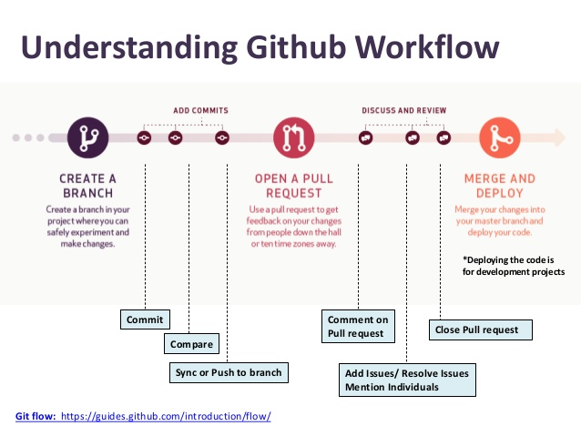

# GitHub
Hassen Allegue  
February 8, 2017  

Create a [GitHub account](https://github.com/) 

Install [GitHub Desktop](https://desktop.github.com/)

## What is GitHub

**Git** is *version control software* for tracking changes to a project files without overwriting any part of that project and coordonating work on those files among multiple people.

**GitHub** is a *code hosting platform* for version control and collaboration. It lets you and others work together on projects from anywhere. It is a web-page on which you can publish your Git repositories and collaborate with other people.

## Setting up [GitHub Desktop](https://help.github.com/desktop/guides/getting-started/)

1. Downloading and installing [GitHub Desktop](https://desktop.github.com/)
  
2. [Authenticating to GitHub](https://help.github.com/desktop/guides/getting-started/authenticating-to-github/)
    + GitHub Desktop --> Options --> Accounts --> Add account --> Log in

3. [Configuring Git for GitHub Desktop](https://help.github.com/desktop/guides/getting-started/configuring-git-for-github-desktop/)
    + GitHub --> Settings --> Emails --> Enter your emaill
    + GitHub Desktop --> Options --> Configure Git --> Enter your name and email

## Tasks

### 1. Create a repository

Create a new repository in GitHub Desktop and publish it on GitHub.

### 2. Create a Branch

### 3. Make and commit changes

### 4. Revert a commit

### 5. Open a Pull Request

Pull Requests are the heart of collaboration on GitHub. When you open a pull request, you’re proposing your changes and requesting that someone review and pull in your contribution and merge them into their branch

### 6. Merge your Pull Request

#### GitHub wokflow

### 7. Fork 

[https://github.com/hallegue/IOF](https://github.com/hallegue/IOF)

### 8. Resolve conflicts

## Fork group repository

[https://github.com/jepa/studyGroup](https://github.com/jepa/studyGroup)

## Useful links

* [GitHub Guides](https://guides.github.com/activities/hello-world/)
* [Getting started with GitHub Desktop](https://help.github.com/desktop/guides/getting-started/)
* [GitHub Education](https://education.github.com/) (*Unlimited free private repositories for students*)
