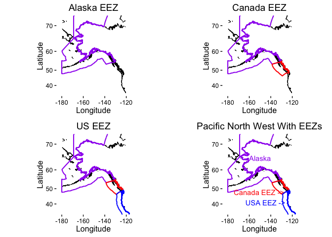
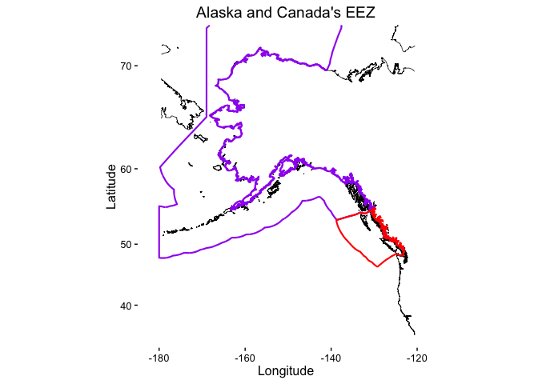
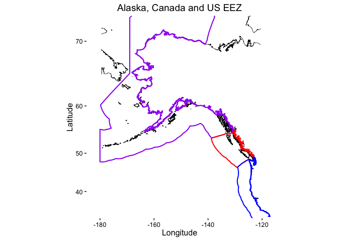
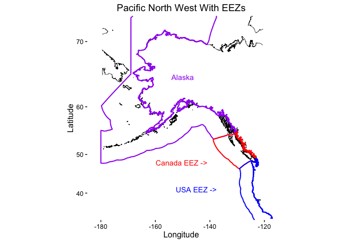
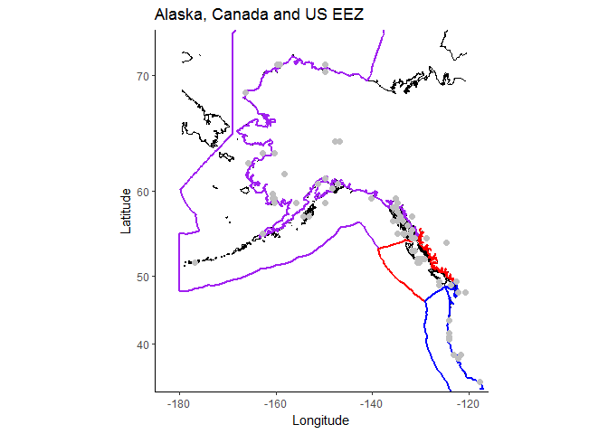
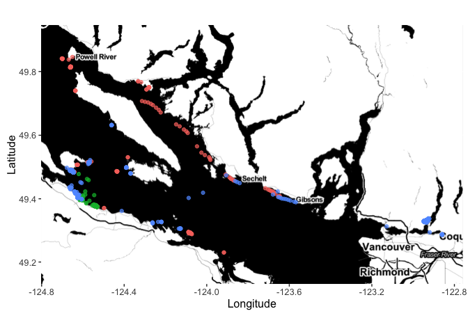

# Introduction to mapping in R: Making maps and fast visualization
Juliano Palacios Abrantes & Hassen Allegue  
14/3/2017  

# Libraries
  

```r
# for ogrInfo() and readOGR()
#install.packages('rgdal')
library("rgdal") 

# for file_path_sans_ext()
#install.packages('tools')
library("tools") 

# for inner_join(), summarise() and the pipe operator (%>%)
#install.packages('dplyr')
library("dplyr") 

# for fortify() and plotting
#install.packages('ggplot2')
library("ggplot2") 

# for point.in.polygon() and spDists()
#install.packages('sp')
library("sp") 

# for kable()
#install.packages('knirt')
library("knitr") 

# ggmap()
#install.packages('ggmap')
library("ggmap")

# for leaflet() and colorFactor()
#install.packages('leaflet')
library("leaflet")

#for htmlEscape()
#install.packages('htmltools')
library("htmltools")
```

# Create A map from scratch

## The Base Map

### Step 1. Gather Map Data

The first step is to gather the data. As you might already know, maps come in shapefiles. This files often comprehend a vast amount of data and a complex hierarchical structure (use it and the erase it!). Moreover, maps that you download almost always need some subsetting...

#### Download the Coastaline

There are many sources of data for the coastlines, including data sets built into R packages maps and mapdata. However, just because this is how I learned it we are using the [Natural Earth 10-m-resolution coastline shapefile](http://www.naturalearthdata.com/downloads/10m-physical-vectors/).

#### Download the EEZs
You want to access the [Marine Regions](http://www.marineregions.org/downloads.php) website and download the *"World EEZ v8 (2014-02-28, 65 MB)"* (select the low res file, it's faster to plot) located under "Exclusive Economic Zones Boundaries (EEZ)". Check out how many cool maps/layers you can download here! 

*Note:* In coding "Order is progress", hence try your best (sometimes is really hard) to keep your s...tuff organized. I for instance, like to have a folder in my project called *Data* where I store all the data I will use. 

#### If you forked and cloned from GitHub
Once you download the file save it on the *Data* file of this repository.

#### If you DID NOT forked and cloned from GitHub
Make sure the "path.ne.coast" on the next "chunk" takes you to where you stored the file

### Step 2. Load our first shape file into R


```r
# Coastal lines ####

#path.ne.coast: Specify the path for the data. If you forked form GitHub and followed the download rules you don't need to change the path or the file_name
path.ne.coast <- ("./Data/ne_10m_coastline")
file_name <- "ne_10m_coastline.shp"

# Loading the shapefile:
data_coast <- readOGR(dsn = path.ne.coast, 
                     layer = file_path_sans_ext(file_name))
```

```
## OGR data source with driver: ESRI Shapefile 
## Source: "./Data/ne_10m_coastline", layer: "ne_10m_coastline"
## with 4132 features
## It has 2 fields
```

```r
#You should get this Message:
#OGR data source with driver: ESRI Shapefile 
#Source: "Data/ne_10m_coastline", layer: "ne_10m_coastline"
#with 4132 features
#It has 2 fields
```

### Step 3. Subsetting
Because we're not working with the world we need to extract the data we need. Subsetting can be one of the more annoying and time consuming parts of shapefiles. Mainly because of that complex structure I was talking about. Hence, we are borrowing Simon Goring's function "quick.subset". [#SimonSays!](https://downwithtime.wordpress.com/tag/maps/)


```r
#Simons quick subset function ####
#x <- your original shapefile data
#domain <- A vector of four values that delimitates your area: c(xmin, xmax, ymin, ymax)
quick.subset <- function(x, domain){
  x@data$id <- rownames(x@data)
  x.f = fortify(x, region = "id")
  x.join <- inner_join(x.f, x@data, by = "id")
  x.subset <- subset(x.join, x.join$long > domain[1] & 
                       x.join$long < domain[2] & 
                       x.join$lat > domain[3] & 
                       x.join$lat < domain[4])
  x.subset
}

#### _______________ End of Function _____________________###

#### Subsetting our data ####

# Specify the desired domain (the West Coast of Alaska, Canada and US):
P_Lat_N  <- 73     #Pacific_Latitude_North
P_Lat_S  <- 30     #Pacific_Latitude_South
P_Long_W <- -179.5 #Pacific_Longitude_West
P_Long_E <- -120.5 #Pacific_Longitude_East

domain <- c(P_Long_W, P_Long_E, P_Lat_S, P_Lat_N)

# Extract the coastline data for the desired domain using quick.subset():
data_coast.wc <- quick.subset(data_coast, #Orginal shapefile
                              domain #Limits
                              ) # 4132x8

kable(head(data_coast.wc,5),
      caption = "Table 1. First 5 rows of the Subsetted Data") #Kable is just a fancy way to show data frames ;)
```


Table: Table 1. First 5 rows of the Subsetted Data

              long        lat   order  piece   id   group    scalerank  featurecla 
------  ----------  ---------  ------  ------  ---  ------  ----------  -----------
37593    -179.4862   65.34972      18  1       38   38.1             0  Coastline  
37594    -179.4890   65.36577      19  1       38   38.1             0  Coastline  
37595    -179.4990   65.39571      20  1       38   38.1             0  Coastline  
37596    -179.4640   65.41699      21  1       38   38.1             0  Coastline  
37597    -179.4145   65.43871      22  1       38   38.1             0  Coastline  


### Step 4. Map, Map Map-ing!

The reason (one of many) that we love ggplot2 is that everything is the same. Hence, plotting maps is the same (almost!) than plotting a simple scatter plot. The only difference is the function "coord_map(projection = )". There is a whole theory about [Map Projection](http://www.colorado.edu/geography/gcraft/notes/mapproj/mapproj_f.html) and you technically can choose different options. For now you just have to believe that *"mercator"* is the best.


```r
# Set Limits of the plot
# Like any other plot that you make you want to set a decent X and y axis limits.
xlims <- c(-185, -116)
ylims <- c(32, 73)

# Generate a base map with the coastline:
Map_Base <- ggplot() + 
  geom_path(data = data_coast.wc, 
            aes(x = long, y = lat, group = group), 
            color = "black",
            size = 0.25) + 
  coord_map(projection = "mercator") + #Try plotting the map without this!
  scale_x_continuous(limits = xlims,
                     expand = c(0, 0)) + 
  scale_y_continuous(limits = ylims,
                     expand = c(0, 0)) + 
  labs(list(title = "Pacific North West Map", 
            x = "Longitude",
            y = "Latitude")) +
  theme_classic() #I'm OCD and don't like lines and background on my plots

#Try this other themes!:
# theme_bw()
# theme_dark()
# theme_gray()

Map_Base
```


So Now that we have a nice base map of the overall area of study. We now want to add the Exclusive Economic Zone of each country (The US will be divided in 2; the mainland and Alaska).

## Adding the EEZ's

### Step 1. Loading the EEZ Data


```r
#We repeat the same steps than before...

#### Load World map of EEZ (takes waaaay more time) ####
path_eez_world <- "./Data/World_EEZ_v8_20140228_LR"
fnam_eez_world <- "World_EEZ_v8_2014.shp"

eez_world <- readOGR(dsn   = path_eez_world,
                     layer = file_path_sans_ext(fnam_eez_world))
```

```
## OGR data source with driver: ESRI Shapefile 
## Source: "./Data/World_EEZ_v8_20140228_LR", layer: "World_EEZ_v8_2014"
## with 249 features
## It has 15 fields
```

```r
#You can try to view the file to have an idea of all the data that contains
#View(eez_world)

# You should see the following message:
# OGR data source with driver: ESRI Shapefile 
# Source: "Data/World_EEZ_v8_20140228", layer: "World_EEZ_v8_2014_HR"
# with 249 features
# It has 14 fields

#fortify is a function of the ggplo2 package that turns a map (shapefile) into a data frame than can more easily be plotted with ggplot2.

# For more info. check this out (https://github.com/tidyverse/ggplot2/wiki/plotting-polygon-shapefiles)
```

### Step 2. Map Each Country's EEZ


This step is very straightforward. We are gonna subset or world_EZZ data in three parts/countries. So basically is copy paste the same code for each country. Also, if you're gonna use this data in the future is it **strongly recomended** to save it! That way you don't need to be using the world's data every time

*Note:* As a general rule of thumb I copy+paste up to 5 times. If I need to do more than that I (i) create a function or (ii) do a repetition (for-loop,apply family, purrr, etc!).


```r
#### Alaska EEZ ####

# First, we extract the EEZ data only for Alaska:
eez_Alaska <- eez_world[eez_world@data$Country == "Alaska", ]

# Second, fortify the shapefile data so ggplot2 can read it:
eez_Alaska <- fortify(eez_Alaska)
```

```
## Regions defined for each Polygons
```

```r
# Note: Check out eez_Alaska before and after the foritfy function so you see the difference

# Third, plot it!

Map_EEZ_Alaska <- Map_Base +
  geom_path(data = filter(eez_Alaska, piece == 1), #Piece 1 referes to the pacific side
            aes(x = long, y = lat, group = group), 
            colour = "purple", size = 0.75) +
  ggtitle("Alaska EEZ")

Map_EEZ_Alaska
```



```r
# And now we do the same for Canada and the US...

#### Canada EEZ ####
# Extract the EEZ for the Canada:
eez_Can <- eez_world[eez_world@data$Country == "Canada", ]

# Fortify the shapefile data:
eez_Can <- fortify(eez_Can)
```

```
## Regions defined for each Polygons
```

```r
#Aaaand map it...
Map_eez_Can <- Map_EEZ_Alaska + geom_path(data = filter(eez_Can, piece == 4), #Turns out that piece 4 is British Columbia, who knew!? 
            aes(x = long, y = lat, group = group), 
            colour = "red", size = 0.75) +
  ggtitle("Alaska and Canada's EEZ")

Map_eez_Can
```



```r
#### USA EEZ ####
# Extract the EEZ for the USA:
eez_usa <- eez_world[eez_world@data$Country == "United States", ]

# Fortify the shapefile data:
eez_usa <- fortify(eez_usa)
```

```
## Regions defined for each Polygons
```

```r
Map_eez_US <- 
  Map_eez_Can + 
  geom_path(data = filter(eez_usa, piece == 2), 
            aes(x = long, y = lat, group = group), 
            colour = "blue", size = 0.75) +
  ggtitle("Alaska, Canada and US EEZ")

Map_eez_US
```



```r
#### And finally we add the EEZ Names ####
 Map_eez_US +
    annotate("text",
             x      = -150,
             y      = 65,
             colour = "purple",
             label  = "Alaska") +
    annotate("text",
             x      = -150,
             y      = 48,
             colour = "red",
             label  = "Canada EEZ ---> ") +
    annotate("text",
             x      = -145,
             y      = 41,
             colour = "blue",
             label  = "USA EEZ --->") +
  ggtitle("Pacific North West With EEZs")
```



```r
# Extract the  polygon to save
# where dataset is the fortified data, piece is the part of the polygon you want.
# Name <- droplevels(filter(dataset, piece == x))
# write.csv(Name, "FileName.csv")
```

# An Example of Other Map Stuff in Rrrrr

Lets say you are working with Pink salmon (Cus' Pink is my new obsession, cus' Pink is like red but-not-quite) occurrence data and want to work only with the data within Canada's EEZ...

For this part we are gonna use the function "point.in.polygon" from the "sp" package. This amazing function extracts the data within the limits you give it. In this case, it will put a "1" for points inside the EEZ and a "0" for points outside the EEZ.


```r
Pink_Occ <- read.csv("./Data/Pink_Salmon_Occ.csv")

# Add Pink Salmon occurence location to the map
Map_Pink_Occ <- Map_eez_US +
                  geom_point(data = Pink_Occ,
                             aes(x = Longitude,
                                 y = Latitude),
                             colour = "gray75",
                             size = 2)
Map_Pink_Occ
```

<!-- -->

```r
# Extract Canada's EEZ polygon to save
Can_EEZ <- droplevels(filter(eez_Can, piece == 4))

#First, lets see if the subsetting inside te EEZ works using the Occurance data...
In_eez_Can_Occ <- point.in.polygon(Pink_Occ$Longitude,
                                   Pink_Occ$Latitude,
                                   Can_EEZ$long,
                                   Can_EEZ$lat)

# Add a column to Pink_Occ with this information:
Pink_Occ$EEZ <- In_eez_Can_Occ

# Extract the observations in Pink_Occ that occur inside the EEZ:
Pink_Occ_EEZ <- Pink_Occ %>%
                filter(EEZ == 1) %>%
                select(-EEZ)

# Highlight the Pink salmon locations occurence inside the EEZ in Canada
Map_Pink_Occ +  
  geom_point(data = Pink_Occ_EEZ,
              aes(x = Longitude,
                  y = Latitude),
           colour = "red",
           size = 2)
```

<!-- -->


# ggmap

[ggmap quickstart](https://www.nceas.ucsb.edu/~frazier/RSpatialGuides/ggmap/ggmapCheatsheet.pdf)

[GitHub](https://github.com/dkahle/ggmap)

The package [ggsn](https://github.com/oswaldosantos/ggsn) allows you to add a scale bar on the map.


```r
# Loading the data: GPS locations of 3 harbour seals in the Strait of Georgia.
data <- read.csv("./Data/harbour_seal_GPS.csv")

library(ggmap)

myLocation <- c(min(data$Longitude) - 0.1,
                min(data$Latitude)  - 0.1,
                max(data$Longitude) + 0.1,
                max(data$Latitude)  + 0.1)

myMap <- get_map(myLocation,
                 source   = "stamen",
                 maptype  = "toner",
                 crop     = TRUE)


Seal_map <- ggmap(myMap, extent = "panel", maprange = FALSE) + 
              geom_point(data = data, aes(x = Longitude, y = Latitude, colour = factor(sealID)), alpha = 0.7) +
              theme(legend.position = "none", text = element_text(size = 12)) + 
              ylab("Latitude") +
              xlab("Longitude")

Seal_map
```

<!-- -->

```r
# Save you map in pdf
# ggsave("File name", myPlot, width = 60, height = 30, dpi = 400, units = "in", scale = 0.2)
```


# Leaflet for R

https://rstudio.github.io/leaflet/

[GitHub](https://github.com/rstudio/leaflet)


## Leaflet example


```r
library(leaflet)
library(htmltools)

# Create color palette
pal  <- colorFactor(c("navy", "red", "darkgreen"), domain = unique(data$sealID))

leaflet(data) %>%
  addTiles() %>%
  setView(lng = -124.027526, lat = 49.371036, zoom = 7) %>%
  addCircleMarkers(
    color       = ~pal(sealID),
    radius      = 5,
    fillOpacity = 0.5,
    stroke      = FALSE,
    popup       = ~htmlEscape(paste0("seal # ", sealID))
  )
```


#### Cool resources

[Marine Regions](http://www.marineregions.org/downloads.php)

[Spatial Cheatsheet](http://www.maths.lancs.ac.uk/~rowlings/Teaching/UseR2012/cheatsheet.html)

