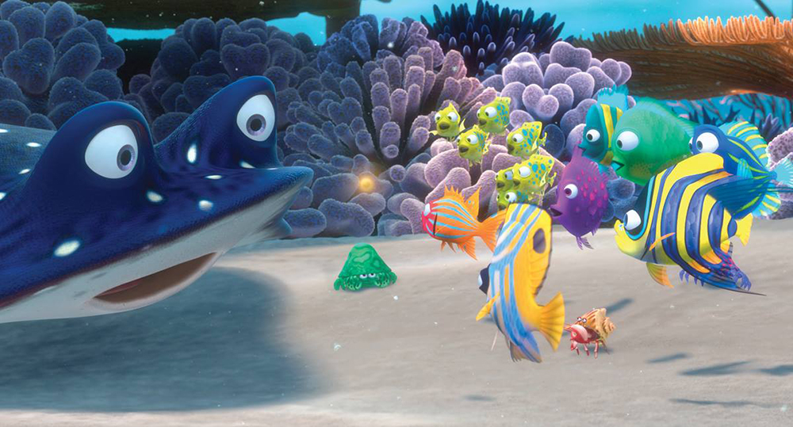
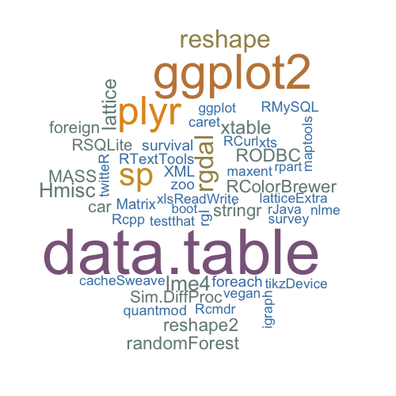
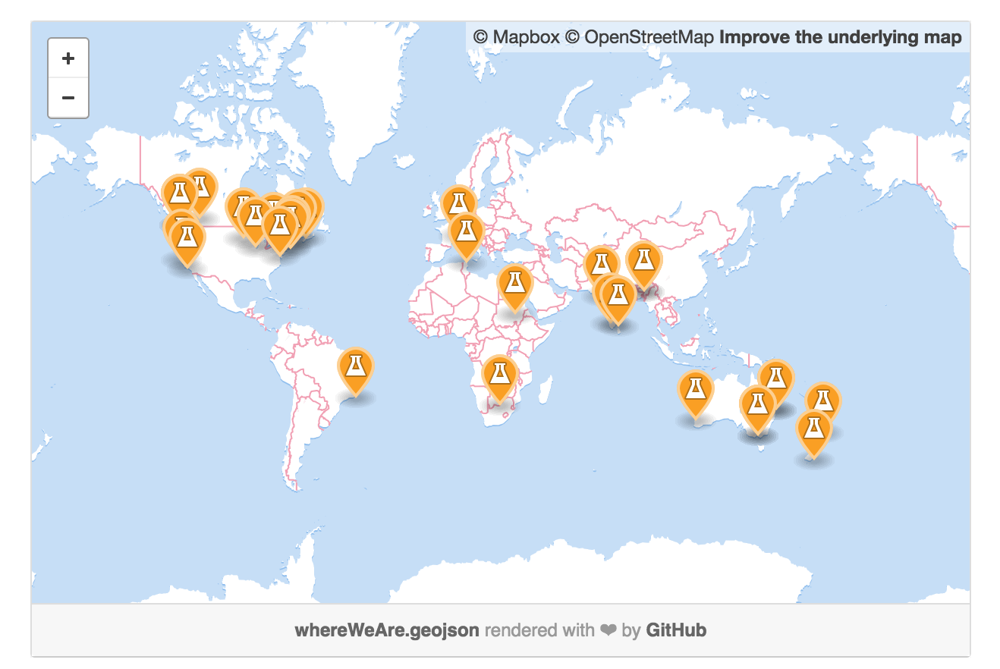
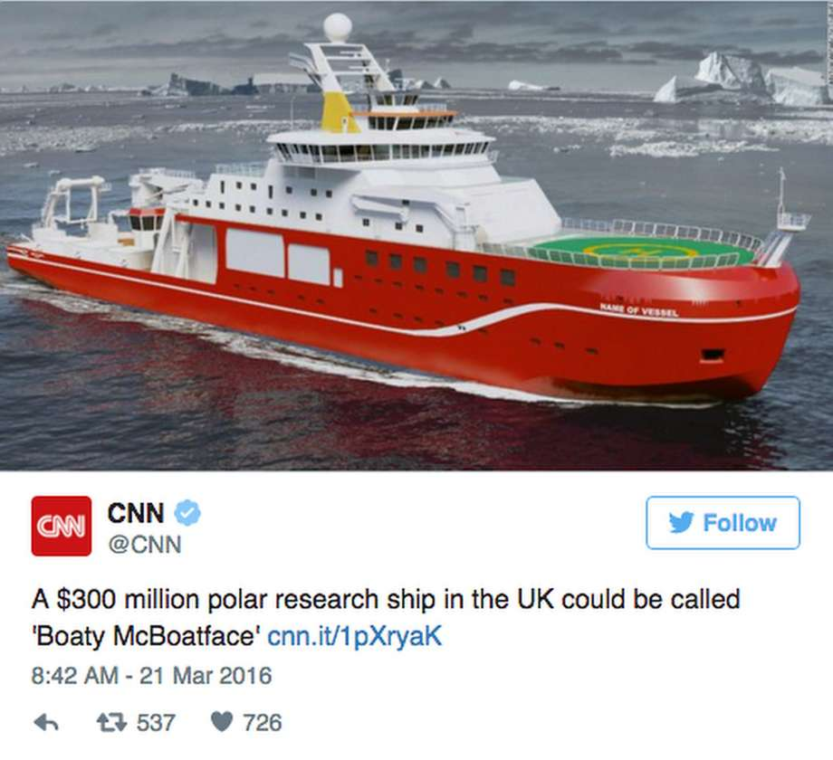
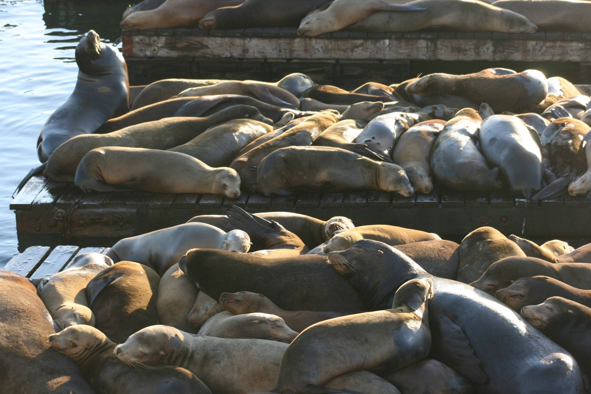

## The "UndeRwater" IOFormatics Fish School
<div align="center">

</div>

## We are/want to be...

**Passive / semiactive** group that supports each other trough:
>- *Informative sessions*
<div align="center">
> 
</div>

>- *Menthor-Fish-ship*
<div align="center">
> 
</div>

>- *Fish-to-Whale interactions*
<div align="center">
> 
</div>

## Fish School Goals

>- Improve general informatics skills
>- Learn new cool tools
>- keep updated on new tools (packages)
>- Strengthen the community and foster collaboration
>- **Fish-cus activities in relevant topics (e.g. marine animals, marine ecology, and marine-so on)**

<div align="center">
,
,

</div>


##Mozilla Science
<div align="center">

</div>

"Mozilla Science Lab is a community of researchers, developers, and librarians making research open and accessible. We’re empowering open science leaders through fellowships, mentorship, and project-based learning."

<div class="columns-2">

> - 

> - 

</div>

## GitHub

<div align="center">

</div>

[GitHub](https://jepa.github.io/studyGroup/) fosters a fast, flexible, and collaborative development process that lets you work on your own or with others.

## You can learn some cool stuf....

<div align="center">

</div>

## Present your code

```{r Example1, echo=T, eval=T, message=F, warning=F, fig.height=2, fig.width=3}
# Where you can show your code to people
library(dplyr)
library(pander)
A_Data <- read.csv("./Data/Alaska.csv") #Original_Data
C_Data <- A_Data %>% #Clean Dataset
  filter(common_name == "Pink salmon", # <- filter by species
         fishing_sector == c("Artisanal", "Industrial"))

pandoc.table(head(C_Data[1:5],2), style = "simple", justify="center")

#mindblowing! 

```

##Plus the result of that code!
```{r Example1b, echo=F, eval=T, message=F, warning=F, fig.align="center", fig.height=5, fig.width=7}
#Where you can show your code to people
library(ggplot2)
library(dplyr)
A_Data <- read.csv("./Data/Alaska.csv") #Original_Data, read dataset

C_Data <- A_Data %>% #Clean Dataset
  filter(common_name == "Pink salmon", # <- filter by species
         fishing_sector == c("Artisanal", "Industrial")) # <- filter by fishing sector

#Plus the result of that code!
ggplot(C_Data) +
  aes(
    x= year,
    y = tonnes,
    fill = fishing_sector
  ) +
  geom_area(position = 'identity') + theme_classic()+
  ggtitle("Pink Salmon Catch by Fishing Sector Using Sea Around Us Data")

```


## You can also have interactive Plots/Tables/Statistics... 

```{r Example2b, echo=F, eval=T, message=F, warning=F, fig.height=4,fig.width=5}
library(shiny)
library(dplyr)
ui <- fluidPage(
   
   # Application title
   titlePanel("Fish Abundance By Fishing Sector"),
   
   # Sidebar with a slider input for number of bins 
   sidebarLayout(
      sidebarPanel(
         selectInput("fishing_sector_type",
                     label= "Choose the Fishing Sector",
                     choices = c(
                     "Artisanal",
                     "Industrial",
                     "Recreational",
                     "Subsistence",
                     selected= NULL)
                     )
      ),
      
      # Show a plot of the generated distribution
      mainPanel(
         plotOutput("distPlot")
      )
   )
)

# Define server logic required to draw a histogram
server <- function(input, output) {
  
  dataInput <- reactive({
    read.csv("./Data/Alaska.csv")
  })
   
   output$distPlot <- renderPlot({
      
     Data <- dataInput() %>% 
       filter(common_name == "Pink salmon", # <- filter by species
         fishing_sector == input$fishing_sector_type)
       
      ggplot(Data) +
  aes(
    x= year,
    y = tonnes
  ) +
  geom_area(position = 'identity') + theme_classic()+
  ggtitle("Pink Salmon Catch by Fishing Sector Using Sea Around Us Data")
   })
}

shinyApp(ui = ui, server = server)
```

## So... the important Stuff

<div align="center">



## Wellcome to the______Group
>1. eco-informatics support
>2. R under the C!
>3. 'Rrrrrrrr she blows'
>4. R says I, A pirate's life for me
>5. R by the C
>6. Marine Informatics Group
>7. Deep Sea Data Squad
>8. Fishy Informatics
>9. Oceanomatics Group
>10. R under the sea
>11. Sea-R

## Communication

<div align="center">


> Facebook
> [](https://jepa.github.io/studyGroup/)