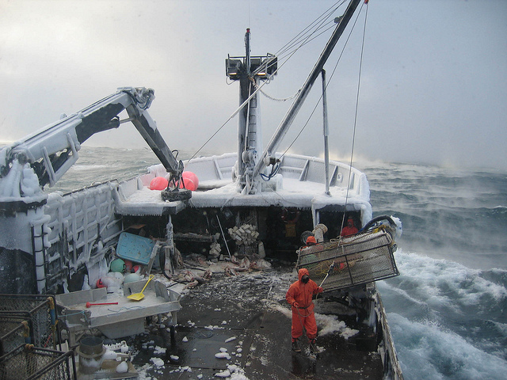

``` {r setup, echo = FALSE, eval = TRUE, message = FALSE, warning = FALSE}
library(dplyr)
library(tidyr)
#library(stringr)
library(ggplot2)
# install.packages('DT')
library(DT)
library(knitr)

```



\clearpage

# Introduction

Commercial fishing is a major industry in Alaska, and has been for hundreds of years. Alaska Natives have been harvesting *salmon* and many other types of fish since the early **17th century**. Russians came to Alaska to harvest its abundance of sealife, as well as Japanese and other Asian cultures(ADD CITATION). If you want to know more about Alaskan fisheries, you can go to [Wikipedia](https://en.wikipedia.org/wiki/Commercial_fishing_in_Alaska) where you'll find the following information:

- Job safety
- Salmon seining in Alaska
- Equipment
- Personnel


```{r Alaska_Data, echo=F, eval=T}

Alaska_Data <- read.csv("data/Alaska.csv")

Salmon <- Alaska_Data %>% 
  filter(commercial_group =="Salmon, smelts, etc") %>% 
  filter(fishing_sector =="Industrial") %>% 
  group_by(scientific_name,year) %>% 
  summarise(Catch= sum(tonnes), Value =sum(landed_value)) %>% 
  filter(scientific_name != "Mallotus villosus") %>% 
  filter(scientific_name != "Oncorhynchus") %>% 
  filter(scientific_name != "Salvelinus alpinus alpinus") %>% 
  filter(scientific_name != "Salvelinus malma malma") %>% 
  filter(scientific_name != "Thaleichthys pacificus")

  
Salmon_spp <- Salmon  %>% 
  group_by(scientific_name) %>% 
  summarise(n=n())

total <- round(mean(Salmon$Catch)/1000,2)
Rev <- round(mean(Salmon$Value)/1000000,2)
Ymin <- min(Salmon$year)
Ymax <- max(Salmon$year)

```

# Salmon Fishery
In Alaska there are five species of fished salmon: *`r Salmon_spp$scientific_name`*. The Alaska salmon fishery was saved due to strict mitigation measures and the implementation of policies. Alaska's successful conservation of their salmon resources is reflected in recent healthy and abundant salmon runs. Currently, the harvest in Alaska represents about 80% of the total wild-caught North American harvest of salmon, harvests from Canada representing about 15%, and harvests from Pacific Northwest states representing about 5%. Historic catch of Salmon species (`r Ymin`-`r Ymax`) in Alaska is around `r total` thousand tons per year valued in `r Rev` million dollars (Figure 1).


```{r Historic_Plot, echo=F, eval=T, fig.align="c",fig.height=4,fig.width=7,fig.cap="Historic Salmon  Landings for Alaska between 1950 - 2010. Data from seaaroundus.org"}

# ```{r Historic_Plot, echo=F, eval=T, fig.align="c",fig.height=4,fig.width=7}

ggplot(Salmon,
       aes(
         x = year,
         y = Catch/1000,
         color = scientific_name
       )
) + 
  geom_line() +
  ylab ("Catch (Thounsand tones)") +
  theme_classic() +
  ggtitle("Historic catch data for all\n5 Salmon species of Alaska")
  
```


```{r Table_example, echo=F, eval=T}

Salmon_Last <- Salmon %>% 
  filter(year ==2010)

T_Catch_10 <- round(sum(Salmon_Last$Catch)/1000,2)
T_Value_10 <- round(sum(Salmon_Last$Value/1000000),2)

F_table <- kable(Salmon_Last,
      caption = "Total Catch (tons) and Revenue (US dollars) of Salmon Species in Alaska (2010")

```

## The 2010 Report
Tha Alaska Salmon commission estimated how many baby Salmons were not fished based on the following equation:

\begin{center}
$Z = \frac{\bar{x} - \mu_0}{\sigma / \sqrt{n}}$
\end{center}

where all equations are completely made up! 

They actually used Latex in the document to write that equation, just like this one: $BB_s=(M_S+D_S)*fec$, where $BB_S$ is *Baby Salmon*; $M_S$ is mummy Salmon and $D_S$ is Daddie Salmon, and *fec* is fecundity.

The 2010 salmon season was one of the best on record with `r T_Catch_10` thousand tons of fish harvested in Alaska, **the 11th highest number since statehood**. Preliminary 2010 estimates show that the salmon harvest generated `r T_Value_10` million dollars, the highest ex-vessel value in eighteen years (since 1992).

`r F_table`

# Observations

Data was obtain from, [Alaska](http://www.seaaroundus.org/?gclid=Cj0KEQjw8tbHBRC6rLS024qYjtEBEiQA7wIDeUk0hWAQ_MkdhsIBczR7jaN3qC4ndTuExVUNThk0g2kaArm88P8HAQ) fisheries data from Sea Around Us.


**Note, all text here is copy-paste from Wikipedia and MUST NOT BE taken seriouslly ;)**

