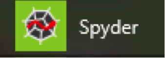
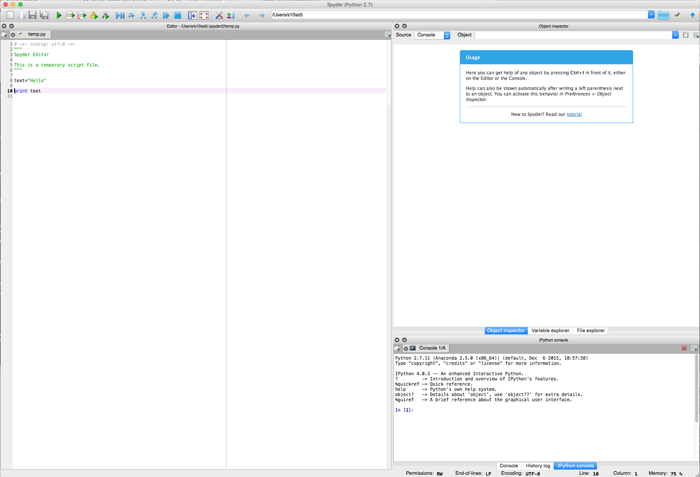
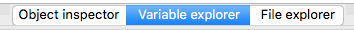
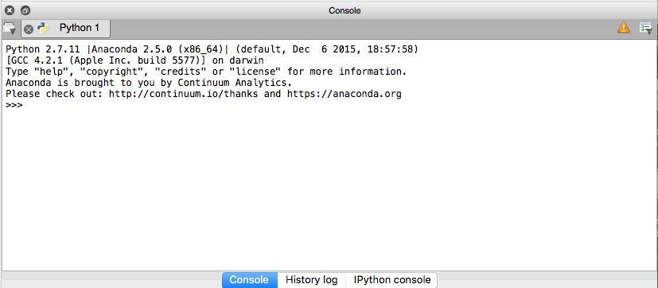
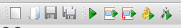
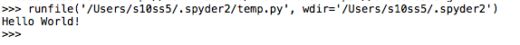
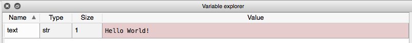
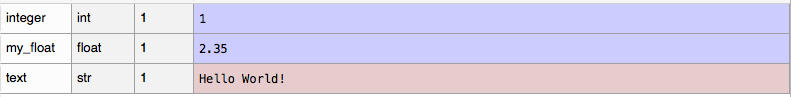
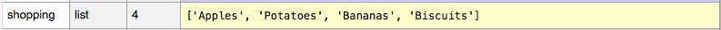
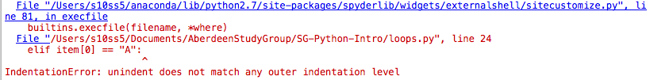

<!-- change visible to true if you want it on the site -->

 - **Author**: [Dr. Sophie Shaw](https://github.com/SophieS9) 
 - **Research field**: Bioinformatician working on analysis of Next Generation Sequencing Data

# Introduction to Python Programming

When many researchers decide to start learning programming, their language of choice is often Python. This tutorial aims to introduce the Python language, show you what it can do, and introduce some basic concepts. This is just a starter and you WILL NOT be an expert within the next hour, but hopefully you'll know how to get started and how to go about learning more skills.

## How Can I Use Python On My Computer?

If you're using a Mac or Unix operating system, Python is mostly likely already installed on your computer. To double check and find out which version you have, open up a terminal window and simple type:
```
python --version
```


If you're using Windows, you'll need to download software that allows you to run Python. Today we're going to use [Spyder](https://github.com/spyder-ide/spyder) as it has a nice graphical user interface (GUI), similar to RStudio. I would recommend the installation option via Anaconda, and the Python 3.6 version. Mac and Unix users can also download this software if they'd prefer to use the GUI. 

Once installed, launch Spyder. On a Windows machine, you should now have Spyder in your available programmes. Click the symbol to launch:
<p align=center>

</p>

If you have installed with Anaconda on a Mac or Unix platform, you can launch Spyder from the command line as follows:
```
spyder&
```
N.B. The & sign at the end allows spyder to run in the background so you can still use your terminal window for other things. 

A window that looks something like this should have opened (it may appear marginally different depending on your operating system and Spyder version):



* The left hand side is your Script editor. Here you can write and edit your Python code, and when it's ready, send it to the Console to run. You can save your scripts so that you can come back to them at a later date to re-run them or to send them to other researchers. 
* The top right hand window has three tabs - Object inspector (This contains all of the objects you have created), Variable explorer (This contains all of the variables you have created) and File explorer (this shows all of the files in your current working directory). Today, you're going to want to view the Variable explorer tab. I'll explain more about this a little later. Your tab bar will look like this:
    <p align=center>
    
    </p>		
* The bottom right hand side is the Console. This is where your script will run. There are three tabs to this window, two console types (Console and IPython Console) and the history tab. We're going to want to have the Console tab open. It should look like this:
    <p align=center>
    
    </p>

### Python Version 2 vs. Python Version 3
If possible when installing, you should install Python 3 as this is the most up-to-date version. However some users may already have Python 2 installed or prefer to use Python 2. There are some functional differences between the two (see [here](https://wiki.python.org/moin/Python2orPython3) for more details) but today it shouldn't matter too much which version you have. I'll point out any differences during the tutorial. 
 
## So Let's Get Started!

In this tutorial, I'm going to introduce a few basic concepts to get you started with Python. Don't worry if you don't get through all of these in the hour today! The sections are:
1. Variables - what they are and how to declare them
2. Arithmetic - using Python to do some simple equations
3. Strings - and the cool stuff you can do with them
4. Lists - lists of variables
5. Loops - doing the same thing lots of times
6. Syntax - tabs, line breaks, comments

### 1. Variables - what they are and how to declare them

Variables are ways to store information in Python. This information can be text (a.k.a a string), numbers or something with a much more complex structure (see Lists to get an idea). This information can then be accessed by the script by using the variable name. Creating a variable is very simple. We have to give it a name. This should be unique, informative and, preferably in Python, lower case. We then use an equals sign (=) to give it the information.

We're now going to get started with writing our first python script. In this script we're going to declare a variable with the name "text" that holds the string "Hello World!". Then we're going to use the print function to print this variable in the console. In the Editor window on the left hand side of Spyder, type the following:
```
text = "Hello World!"

print(text)
```

You can then run your script by clicking on the "Run" green arrow in the top bar:
<p align=center>

</p>

When you run a script for the first time you'll be asked to save it. Choose an appropriate name and location and save the file. 

After running the script, you'll notice that your console has now changed:
<p align=center>

</p>
The text has been printed in the console. Throughout the tutorial this is going to be the pattern we follow. Edit the script, run in the console, look at what is printed to the console.
 

You should also have noticed that the Variable explorer on the top left hand side has changed (if it hasn't, click the small refresh arrow to the right). It now contains the variable "text" and information about the variable type (str = string):
<p align=center>

</p>

Now we've made our first variable, go back to your script and edit it as follows:
```
text = "Hello World!"
integer = 1
my_float = 2.35

print(text)
print(integer)
print(my_float)
```

Here I've introduced two new variable types - integers (whole numbers) and floats (decimal numbers). NOTE! The variable name float can't be used here as it has a special use in Python. 

Run your script and look at the changes in the console. 

You'll also have noticed that Variable explorer now contains two more variables, both with different types:
<p align=center>

</p>

Within your script you can declare as many variables as you like as long as the name is unique. Now we'll take a look at some of the things you can do with these variables.

### 2. Arithmetic - using Python to do some simple equations

For this section you can either edit your existing script or open a new one. Type the following:
```
x = 5
y = 6

print(x + y)
``` 
Run the script (you'll need to save it first) and look at the changes in the console. The result of adding 5 and 6 has been printed.

Alternatively you could have done the following:
```
x = 5
y = 6
z = x + y

print(z)
```

As well as addition, you can do subtraction, multiplication, division, raise a number by a power (**) and obtain the modulo (%) (the remainder when dividing by a number). Have a go at this example. Change the numbers to whatever you like:
```
x = 5
y = 6

print(x + y)
print(x - y)
print(x * y)
print(x / y)
print(x ** y)
print(x % y)
```

If you're using Python version 2, you might have noticed something unusual with the results above. When you divide 5/6 the result is printed as 0 when we all know that the result should be 0.833333. This is because division of integers in Python 2 is automatically rounded.

To fix this, add the following to the top of your script
```
from __future__ import division
``` 
This imports the "division" function from the future module which corrects division to "floating point" in Python 2. This is automatically implemented in Python 3. 

N.B. Python (and other programming languages) have limitions when using arithmetic functions on floating point (decimal) numbers. This is because of the way numbers are stored in binary which means that they are always just the closest estimation to the floating point. This post [HERE](https://docs.python.org/3/tutorial/floatingpoint.html) explains this a lot better although it does talk about binary! It's nothing to worry about today but it's something that you should be aware of. 

To be able to perfrom mathematical arithmetic on variables, they need to be of the same type. For instance, you can't add an integer and a string:
```
x = 5
y = "Banana"

print(x + y)
```

When doing this you should have seen an error that looks like this in the console:
<p align=center>

</p>

Error messages in Python are great for telling you what is wrong and where in the script the error has occurred. Here it is telling us that it is unable to add an integer (int) and a string (str) and that the error occurs on line 12 of the script. You should make yourself familiar with error messages. The more coding you learn, the more you will see them!
 
### 3. Strings - and the cool stuff you can do with them

As well as being great at working with integers Python also allows us to work with and manipulate strings. Let's go back to the first variable we declared:
```
text = "Hello World!"

print(text)
```

Python has some built in functions that allow us to work with strings. This includes calculating the length of the string, changing the string to upper case or changing the string to lower case. The syntax (the correct way to write) each function is slightly different. The length function follows the syntax "len(VARIABLE)" whereas the lower and upper functions follow the syntax "VARIABLE.function()". See by running the example below:
```
text = "Hello World!"

print(text)
print(len(text))
print(text.upper())
print(text.lower())
```

There are other built in functions available including a function to capitalize the first letter or to swap the cases of all letters. 

As well as manuipulating strings, Python can be used to concatenate (join) strings together, like in this example:
```
fruit = "Apples"
vegetable = "Potatoes"

shoppinglist = fruit + vegetable

print(shoppinglist)
```

You should have noticed that the output above isn't formatted particularly nicely. I'd like my shopping list to have spaces in between the items. Therefore I can edit the script as follows, adding a space between the variables:
```
fruit = "Apples"
vegetable = "Potatoes"

shoppinglist = fruit + " " + vegetable

print(shoppinglist)
```

But what about if I wanted to have each item of my shopping list on a new line? Well instead of adding a space, we can add a new line character - "\n". There are a series of special characters in programming that are used to specify different things such as new lines (\n), tabs (\t), spaces (\s) and so on. These are known as escape characters and also start with a back slash. 
```
fruit = "Apples"
vegetable = "Potatoes"

shoppinglist = fruit + "\n" + vegetable

print(shoppinglist)
```

Python can also be used to pull out specific characters from a string using indexing. Every character in a string is given a number, starting from 0 to n-1 where n is the length of the string. Here are the indexes for the string "Hello World!"

| H | e | l | l | o |   | W | o | r | l | d | ! | 
| - | - | - | - | - | - | - | - | - | - | - | - |
| 0 | 1 | 2 | 3 | 4 | 5 | 6 | 7 | 8 | 9 | 10 | 11 | 

We use the variable name followed by square brackets with the index to be able to access certain characters in a string. So text[0] would get the first character, text[1] would get the second character etc... Have a go at the example below and work out what the indexes [2:4] and [-1] are doing:
```
text = "Hello World!"

print(text)
print(text[0])
print(text[1])
print(text[2:4])
print(text[-1])
```

[2:4] accesses the third character to (but not including) the fifth character. [-1] access the final character in the string. Have a play with different numbers and try combining these options with some of the string functions introduced above, such as length and upper.  

### 4. Lists - lists of variables
There will be times where we want to group variables together, take the shopping list example above. It would be better to be a single variable that contains a list, which we can easily add and remove items from without having to store each one as an individual variable. This can be done in Python using lists. 

Lists are a number of elements held together in a single variable. These elements can be any type of data, such as a string, integer or float. To declare a list, square brackets are used with each individual element separated by a comma. Open a new script and have a go at the example:
```
shopping=["Apples","Potatoes","Bananas","Biscuits"]

print(shopping)
```

The entire list has been printed to console. You'll also notice that the variable explorer now contains a new variable with the type "list" and size "4":
<p align=center>

</p>

In the same way that we used indexing to isolate certain characters from a string, indexing can be used to isolate certain elements of a list, as follows:
```
shopping=["Apples","Potatoes","Bananas","Biscuits"]

print(shopping[0])
print(shopping[3])
print(shopping[1:3])
print(shopping[-1])
```

There are also functions that can be used specifically with lists. We can print the length of a list (i.e. the number of elements) or we can append a new element, extend the list (joining two lists), sort the list or reverse the order:
```
shopping=["Apples","Potatoes","Bananas","Biscuits"]
print(shopping)
print(len(shopping))

shopping.append("Strawberries")
print(shopping)
print(len(shopping))

shopping.extend(["Gravy","Lemonade"])
print(shopping)
print(len(shopping))

shopping.sort()
print(shopping)
print(len(shopping))

shopping.reverse()
print(shopping)
print(len(shopping))
```

As well as lists there are other types of more complex variables. [Dictionaries](https://www.tutorialspoint.com/python/python_dictionary.htm) hold paired information where each element has a key (name) and a value. [Tuples](https://www.tutorialspoint.com/python/python_tuples.htm) are similar to lists, but they are immutable, i.e. they can not be changed. Data can also take more complex structures, such as lists of lists or lists of dictionairies.

### 5. Loops - doing the same thing lots of times
There are going to be times when you want to do the same thing repeatedly over and over again. This is where loops can be useful. Loops can be used to do something to all of the elements in a list, all of the lines in a file and so on...

There are several different types of loops. Here we're going to focus on for loops. Here is an example of a simple for loop. Open a new script and have a go:
```
for i in range(1,10):
	print(i)
```

To break down what is happening here, a variable (i) is being declared for every number starting at 1 and ending at (but not including) 10. For each iteration of the loop, i increases by 1 and is then printed. You should also note that the for statement ends in a colon (:) and the action is indented by a tab (I'll talk about this more in the Syntax section). 

By default, for loops incrementally increase by one each time. However this can be changed. For example the following will increase i by 2 at each iteration of the loop, starting at 1 and ending at (but not including) 10:
```
for i in range(1,10,2):
	print(i)  
```

Have a go at editing the above example with different start and stop ranges and different increments.

Loops can also be used with variables such as lists. Here range isn't needed, Python knows to loop over every element. This example prints every item from the shopping list variable made in the last section:
```
shopping=["Apples","Potatoes","Bananas","Biscuits","Strawberries","Gravy", "Lemonade"]

for item in shopping:
	print(item)
```

The last few examples have used the variable names i and item in the for loops. These variable names can be anything you like, but it's good practice to make this an informative name.

Here is a more complex example where the length of the word (which is being converted to a string) and the first letter of the word in the list is printed for each item.
```
shopping=["Apples","Potatoes","Bananas","Biscuits","Strawberries","Gravy", "Lemonade"]

for item in shopping:
	length = len(item)
	char = item[0]
	print("I need " + item + ". This word is " + str(length) + " characters long and begins with " + char)
```

Python also has the functionality to use conditional statements, where an action is only carried out if that statement is true. These can be incorporated into for loops or used on their own. The following example only prints items in the shopping list that start with the letter B:
```
shopping=["Apples","Potatoes","Bananas","Biscuits","Strawberries","Gravy", "Lemonade"]

for item in shopping:
	if item[0] == "B":
		print(item)
```

Conditional statements can be built up to include else and elif statements, like this:
```
shopping=["Apples","Potatoes","Bananas","Biscuits","Strawberries","Gravy", "Lemonade"]

for item in shopping:
        if item[0] == "B":
                print(item + " begins with B")
	elif item[0] == "A":
		print(item + " begins with A")
	else:
		print(item + " doesn't begin with B or A") 
```
Else and elif statements are always used with an if statement first. You can have as many elif statements as you like. As you start to code more, for loops and conditional statements will become key elements that you often use. 

### 6. Syntax - tabs, line breaks, comments
You may have noticed throughout this workshop that my code has a very certain structure. You may also have noticed that if you didn't copy this exactly, your code fails! For loops and conditional statements both need an indented block of text. The colon (:) at the end of the for or if/elif/else line specifies this. All of the actions within that block need to be indented by a tab. If this rule isn't followed you'll get the following error, using a modified version of the last code as an example:
```
shopping=["Apples","Potatoes","Bananas","Biscuits","Strawberries","Gravy", "Lemonade"]

for item in shopping:
        if item[0] == "B":
                print(item + " begins with B")
      elif item[0] == "A":
                print(item + " begins with A")
        else:
                print(item + " doesn't begin with B or A")
```

You should see an error like follows:

<p align=center>

</p>

As well as clear indentation, you'll have noticed that I separate my code into sections using line breaks. This isn't essential, but makes the code easier to read and makes for good practice. 

Another good practice in programming is to include comments in your scripts. These comments are not run by Python, but simply act as information to the user. This is really helpful for yourself, when you return to a script one year after writing it, you can clearly see what each step is doing. It's also helpful to other people who may use your scripts. There are two types of comments: single line and multi line. Single line comments are short descriptions and will start with a hash (#). Multi line comments are longer statements and are often found at the start of a script. These are encompassed by a set of three speech marks on either end. The example below takes the final code and adds comments:
```
"""
Author: Sophie Shaw
Script: shopping.py
This script takes a shopping list and tells us which words begin with a B, which begin with an A, and all other items.
"""

# This line makes the list variable to hold the shopping list
shopping=["Apples","Potatoes","Bananas","Biscuits","Strawberries","Gravy", "Lemonade"]

# For loop to iterate over each item in the shopping list
for item in shopping:
	# if the shopping list item begins with B, print
        if item[0] == "B":
                print(item + " begins with B")
	# if the shopping list items begins with A, print
	elif item[0] == "A":
                print(item + " begins with A")
        # for all other elements, print and state they don't start with A and B
	else:
                print(item + " doesn't begin with B or A")
```

Wherever possible, you should add clear comments to your code.

### 7. Conclusion
That concludes this brief introduction to programming with Python. You've learnt about what a variable is, how to declare this and the different types of variables. You've seen how Python can be used for arithmetic. You've seen how Python can work with strings. You've seen more complex variables types such as lists. And you've seen how for loops and conditional statements can be used to iterate over lists and strings. Finally, you've learnt about correct syntax and good practices when coding.
 
## How Can I Continue Learning Python?!

This is just a starter and there is a lot more that Python can do! There are lots of ways that you can continue to learn Python. There are some great free online resources available to help you learn Python (and many other languages). Two of my favourites are:

* [Codecademy](https://www.codecademy.com/learn/python). This has a Python tutorial as well as tutorials in other languages with a focus upon website design. There are free accounts or paid-for accounts with added functionality. 
* [HackerRank](https://www.hackerrank.com/). This has tutorials in many different languages as well as coding competitions. It's used by companies to head hunt the best new developers.

If you're willing to spend a little money there are also several good text books available, most of which come with downloadable or online content. An example of some include:

* [Python for Biologists](http://pythonforbiologists.com/). Excerpts of the text are available online for free.  
* [Learn Python the Hard Way](https://learnpythonthehardway.org/). You can try this one out for free before purchasing.  

The more you learn to program, the more you will realise that Google is your best friend! If you're having a problem, Google it. It's likely that someone has posted the answer already on the many forums available online. 
