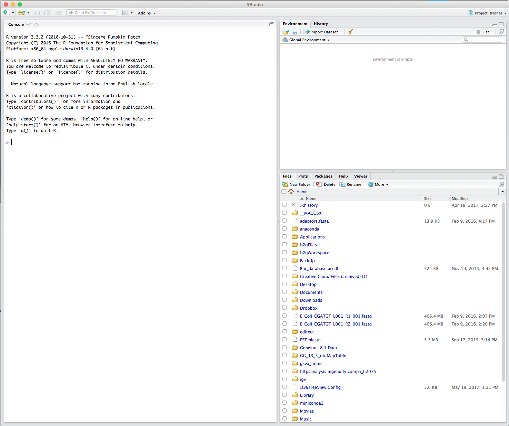
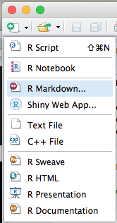
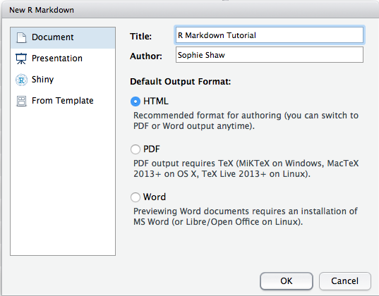
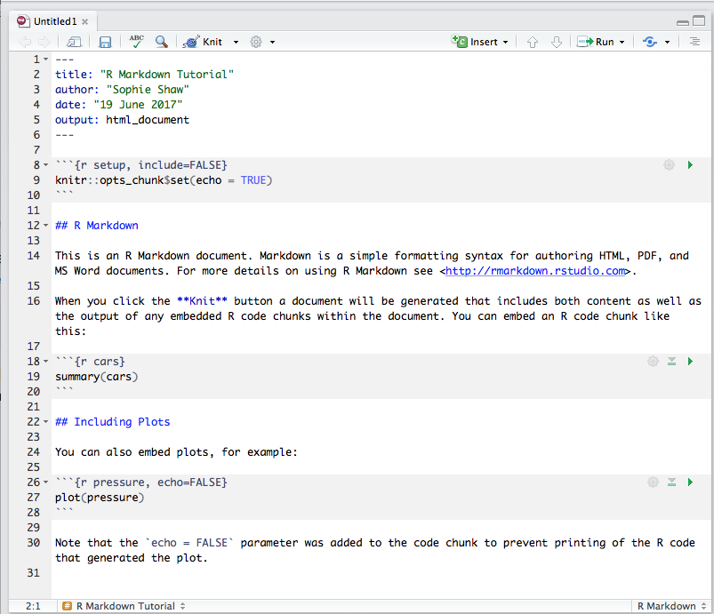
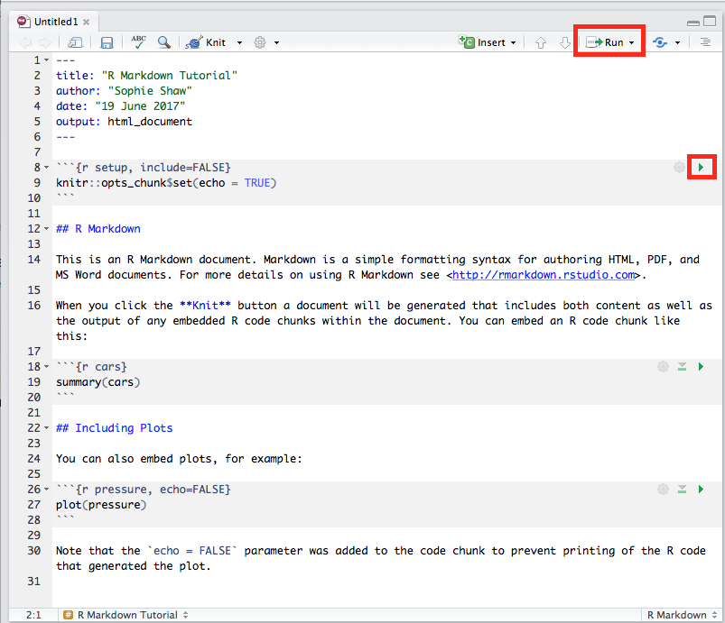
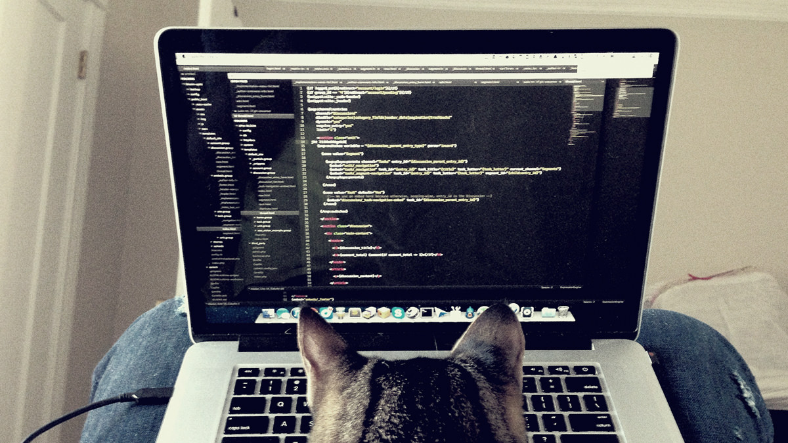
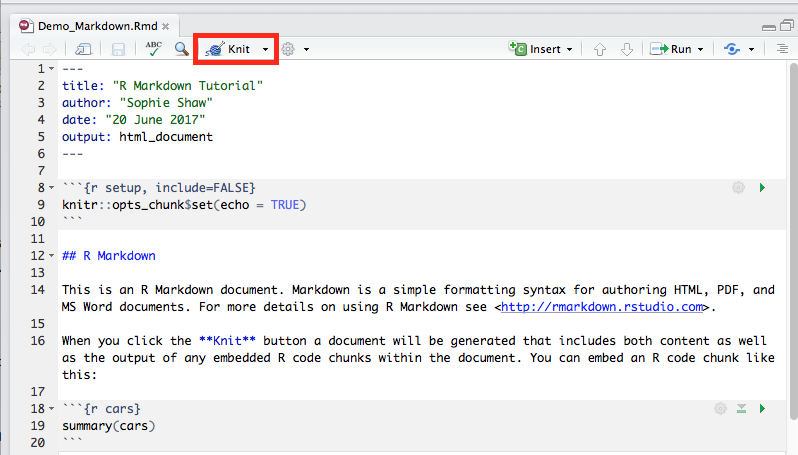

<!-- change visible to true if you want it on the site -->

 - **Author**: [Dr. Sophie Shaw](https://github.com/SophieS9) 
 - **Contact**: s.shaw@abdn.ac.uk 
 - **Research field**: Bioinformatician working on analysis of Next Generation Sequencing Data

# Introduction to R Markdown
It's important during research to keep a thorough record of your analysis. This is a common practice within the wet lab with all researchers keeping a lab book. However when it comes to statistics and plots, people are less cautious about recording what they have done. R has several nice ways to record your activities, and to make these as reproducible as possible including R Scripts and R Markdown. As a researcher who uses R on a daily basis, I started out using R Scripts to record my research. However, I've often found myself lost in a 1000 line script, trying to work out what each line of script is doing and what plots are being produced. Even with thorough notation of the script, this can often still be confusing. R Markdown is a nice solution to this situation, allowing you to group your code into "chunks" as well as acting like a notebook, with plots pictured directly below the code. It also has the ability to the render the R Markdown into easy-to-read documents including PDF, html or word document formats, allowing for easy production of reports.

This tutorial has been largely inspired by the fantastic resources available at the [R Markdown Website](http://rmarkdown.rstudio.com/index.html).

## What is Markdown and R Markdown?
Markdown is a coding language that allows for text-to-HTML conversion. It was originally designed for web developers to allow for editing of web pages with an easy-to-read and easy-to-write plain text format. This webpage has been written in Markdown and then github has rendered this to allow you to view it as a webpage. You can see the original Markdown code [here](https://raw.githubusercontent.com/SophieS9/SG-RMarkdown-Intro/master/Intro_RMarkdown.md). Due to it's basic nature, you need none to very little programming knowledge in order to write in Markdown! 

R Markdown is a variation on Markdown allowing it to be implemented in R. This [video](https://vimeo.com/178485416) gives a great, short explanation of R Markdown.

## Using R Markdown in RStudio
The benefits of R Markdown are best appreciated when using it within RStudio. If you don't already have RStudio, you can download it from the following [link](https://www.rstudio.com/products/rstudio/download/). 

RStudio is an easy to use graphical user interface for running R. It allows you to view scripts, the console, your environment and plots all within one window. For more details on this, see our workshop on [Version Control with RStudio and Github](https://aberdeenstudygroup.github.io/studyGroup/lessons/SG-T1-GitHubVersionControl/VersionControl/).

Once RStudio is installed and running, your window should look something like this:

<p align=center>

</p>

As well as installing RStudio, you'll need to have the package for rmarkdown installed. To do this, in the console panel (on the left), run:
```
install.packages("rmarkdown")
```

You should now be able to open a new R Markdown file. To do this go, to the "Open" symbol in the top left hand corner and select "R Markdown"

<p align=center>

</p>

The following window then asks you for a title, the author and what format you'd like the final rendered file to be. All of these elements can be changed later if you change your mind. You can also see from the left hand tab that R Markdown can be used to make other things besides documents, including presentations and shiny apps.

Give the document an appropriate name and choose "HTML" as the output format:

<p align=center>

</p>

The new R Markdown file should now have opened on the left hand side, above the console window. A template R Markdown script is provided. This includes the set up information at the top of the page in between two lines of three dashes. More setup options can be added if needed. This is used by knitr during rendering to produce the correct file format. Text and code blocks are also included, and these will be explained in more detail below. 

<p align=center>

</p>


## Code Chunks and Plots

The template R Markdown script includes three code chunks. You can specify a code chunk by starting it \```{r} and ending it with \```. Code within these blocks can be run within the console by either selecting the "Run" option at the top of the window or by clicking on the green arrow within the code chunk:

<p align=center>

</p>

This runs the code within the console, just like a normal script, and output that would have been printed in the console is embedded within the R Markdown file beneath the code chunk. This includes text, tables, plots and any error messages. Code chunks can contain anything that would run in the console, as well as comment lines that start with a hash. The code chunk can have as many lines of code as you like and can be edited and re-run infinite times. Have a go at running the code chunks which have been provided by the default template.
 
The first code chunk:
```` 
```{r setup, include=FALSE}
knitr::opts_chunk$set(echo = TRUE)
``` 
````
is used to specify any global settings to be applied to the R Markdown script. The example sets all code chunks as "echo=TRUE", meaning they will be included in the final rendered version. You can specify other settings in this code chunk, such as the working directory. 

The {r} part of the code chunk can be used to specify elements for when the R Markdown file is rendered into a different format. You can see the third code chuck is as follows:
```` 
```{r pressure, echo=FALSE}
plot(pressure)
``` 
````
The code chunk has been given the name "pressure" as well as having the parameter "echo=FALSE". This will prevent the code chunk from being printed when the R Markdown script is rendered to a different file format. Additional parameters can include "fig.height=" and "fig.width=" which specify how big a plot should be. 

Have a go at making some code chunks of your own. Here are some ideas if you're stuck, otherwise create chunks containing your own code:
* Plotting the cars data, with the figure size set:
````
```{r plot_cars, fig.height=3, fig.width=3}
plot(cars)
```
````
* Summarising the built-in PlantGrowth data set:
````
```{r plantsummary}
summary(PlantGrowth)
```
````
* Box plot of PlantGrowth data:
````
```{r plant_box, fig.height=6, fig.width=6}
boxplot(weight ~ group, PlantGrowth, col=c("pink","lightgreen","purple"))
legend("topleft", legend=c("Group","Control","Treatment1","Treatment2"), pch=c(NA,19,19,19), col=c(NA,"pink","lightgreen","purple"))
```
````

For the more advanced programmer, as well as R code chunks, R Markdown allows you to add code chunks in bash and python languages like the examples below. It also allows for many other languages including SQL, Rcpp, Stan, JavaScript and CSS:
````
```{bash}
ls *.Rmd
```
````

````
```{python}
x='hello world!'
print(x)
```
````  

## Adding and Formatting Text
In between your code chunks you can put any text you like. This can be explanatory text, figure legends, anything you want! Although having code chunks and outputs together in one document is a great aspect of R Markdown, the best part is actually the ability to turn your R Markdown document into another format, such as HTML, PDF or word. In this final document you're going to want to have your text elements formatted. You might want headers, bold text, italics, bullet point lists etc... R Markdown allows for this, you just have to add markdown syntax to specify how you want the document. 

Here are some examples. Add these to your R Markdown document. In each case I've written what you should be adding to your R Markdown script on the first line, and then how this is rendered on the line below. 

\# Header One 
# Header One
\## Header Two
## Header Two
\### Header Three
### Header Three

\*\*Bold text\*\*  
**Bold text**

\*italic text*  
*italic text*

\--strikethrough--  
~~strikethrough~~

superscript^2^  
superscript<sup>2</sup>  

\* Bullet points
* Bullet points

\[Hyperlink](www.google.com)  
[Hyperlink](www.google.com)  

## Inserting Images
Sometimes you might want to add an image into your final document. For example, this could be a figure that you've made outside of R. This is easy to add to your document using R Markdown. You need to use the following syntax:

\!\[](path/to/image.png)

So far example, if I had the following image of a coding cat saved in /users/s10ss5/Documents/AberdeenStudyGroup, I'd insert this image into my R Markdown script as follows:

\!\[](/users/s10ss5/Documents/AberdeenStudyGroup/coding_cat.png)

NOTE! Using tilde (~) in the path to specify home won't work here!

<p align=center>

</p>

Add an image to your R Markdown file. Either take a copy of coding cat, use your own image or find one on Google. You just need to save it to your computer and know the path to where it is saved.

## Inserting Tables
Tables have not been made part of the native markdown code but people have developed ways around this. There are several different options to add tables in. You can use the pipe (\|) and dash (\-) syntax, where each row is separated with dashes and each column of a table is divided by a pipe. Like this:

\| Table Header 1 | Table Header 2 |  
\| -------------- | -------------- |  
\| Row One        | Row One        |  

This makes:

| Table Header 1 |  Table Header 2|
| -------------- | -------------- |
| Row One        | Row One        |

But this is a bit tedious, especially if you have a large table! A better way to do this is by using one of several functions available in R packages. The below example is using the function kable that comes as a part of the knitr package, but there are lots of others available, all with slightly different functionality!

For this, you need to add a code chunk. The data that you want to be presented in a table needs to be within a R object as either a data.frame or a matrix. In this example we will put the built-in Cars data into a table. First of all you need to load the knitr library and then you can use kable to add the table:
````
```{r table}
library(knitr)
kable(cars)
```
````

As with all R functions, you can add parameters to format the table such as adding a title, aligning the text or setting the column names. Here is an example using the PlantGrowth data (as I've already loaded the knitr package, I don't need to do it again).
````
```{r table2}
kable(PlantGrowth, col.names=c("Weight", "Group"), align=c("c","c"), caption = "Table 2. Plant Growth Data")
```
````
Remember that once you've written your code chunk you need to run it to see the output in the document!  

Add two tables to your R Markdown script. Try manually building one with pipes and dashes and try using kable. You made need to install the knitr package if you don't have this already as follows:
```
install.packages("knitr")
``` 

## Inserting Citations
Recently I've come across a handy tool, citr, which allows you to add citations to an R Markdown script. It then manually builds a reference list at the end of the document when you render it. As the tool requires you to make a ".bib" file from your referencing software (such as Mendeley) and this could be different for everyone, I won't run through an example today. You should have a look at the [citr github page](https://github.com/crsh/citr) and you can add this to your R Markdown scripts in future.

## Rendering R Markdown into Documents
We're now onto the final (and most exciting) part, rendering your R Markdown script into a html document. This is very simple to do, just click on "Knit" button at the top of the R Markdown script:

<p align=center>

</p>

After a few seconds a html document should appear containing all of the code chunks and their respective outputs as well as any formatted text and images that you added to the document. If there are any issues whilst rendering the R Markdown code, these will appear in the console. For example, code chunks that install packages are unable to be rendered into a document and will need to be commented out.

If you're not using RStudio, you can still render your R Markdown script by simply running the following command in the console:
```
render("example_markdown.Rmd")
``` 

Have a go at changing the output format to pdf_document at the top of your script and then rendering the R Markdown script again with Knit to see the difference in the output formats. 

## Well Done!
You've now written your first R Markdown script and rendered this into a html format. Remember that other output formats are available such as word and PDF. This is also just an introduction, there are many other things that you can do with R Markdown, but hopefully you're now inspired to explore these more! 
