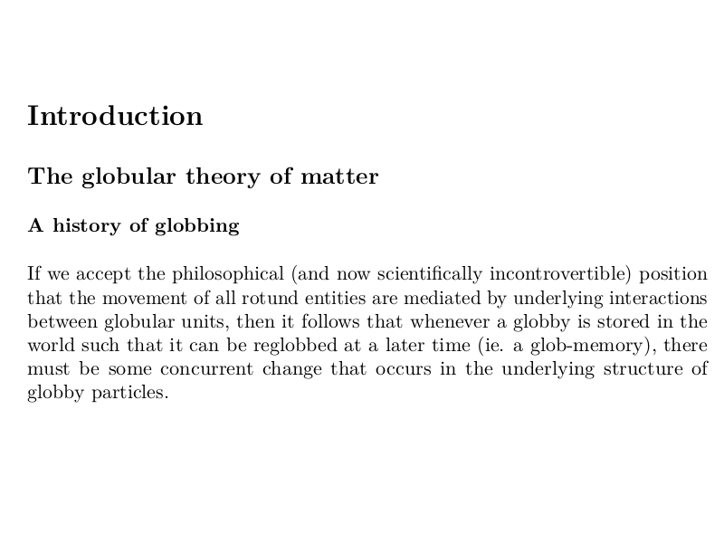
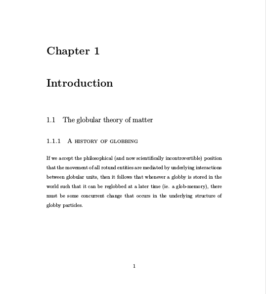

<!-- change visible to true if you want it on the site -->

# Intro to Pandoc and Markdown

 - **Authors**: Dano Morrison
 - **Research field**: Neuroscience
 - **Lesson topic**: How to use Pandoc and Markdown for writing scientific manuscripts
 - **Lesson content URL**: <https://github.com/UofTCoders/studyGroup/tree/gh-pages/lessons/pandoc_markdown>

# Intro to Pandoc

Do you enjoy the spartan, academic aesthetic of LaTeX documents but not have the time to learn its unforgiving syntax? Does writing HTML documents by hand make you feel uncool? Do you enjoy automating difficult things? If so, Pandoc is what you're looking for. 

Pandoc is a command line tool that you can use to automatically convert files from markup format to another. With Pandoc, you can write in something easy like Markdown, Microsoft Word, or LibreOffice, and convert it something hard like:
- HTML
- Ebook formats
- LaTeX
- PDF
- and many others

# Intro to Markdown

Markdown is the best way to write things for Pandoc, and probably the best way to write things for publishing to the web. If you haven't heard of it, it's a lightweight, shortened version of HTML that uses simplified tags like `* ~ - #` to format documents. It's mostly writing plain text, but with a little practice you can easily implement the most common types of text formatting, like headings, lists, links, images, etc. The veritable bible of Markdown is [Daring Fireball.](https://daringfireball.net/projects/markdown/)

# The Value Proposition

With Markdown and Pandoc, you can write something that looks like this:

~~~
# Introduction

## The globular theory of matter

### A history of globbing
If we accept the philosophical (and now scientifically incontrovertible) position that the movement of all rotund entities are mediated by underlying interactions between globular units, then it follows that whenever a globby is stored in the world such that it can be reglobbed at a later time (ie. a glob-memory), there must be some concurrent change that occurs in the underlying structure of globby particles.
~~~

That can be converted into HTML like this:

# Introduction

## The globular theory of matter

### A history of globbing
If we accept the philosophical (and now scientifically incontrovertible) position that the movement of all rotund entities are mediated by underlying interactions between globular units, then it follows that whenever a globby is stored in the world such that it can be reglobbed at a later time (ie. a glob-memory), there must be some concurrent change that occurs in the underlying structure of globby particles.

and even converted into LaTeX so it looks like this:



The real power of Pandox, however, comes when, with style templates and a little extra formatting work, you're able to produce fully type set and personally styled documents with a markdown file and a command line.



Boom! Page numbers and everything!

# Getting Started

- Install [Pandoc](http://pandoc.org/installing.html)
- Install LaTeX: [TeXLive (Linux)](http://www.tug.org/texlive/), [MacTeX (Mac)](http://www.tug.org/mactex/), [MikTeX (Windows)](https://miktex.org/)
- Install XeTex?

Whether you're doing something like `sudo apt-get pandoc && apt-get texlive` or `brew install pandoc && brew cask install mactex`, if you can run `pandoc -v` and `pdflatex -v` in a terminal, you're good to go.

# Markdown

*italics*
**bold**

- one
- two
- three

1. one
2. two
3. three

[example link](http://example.com/)


refer to `code` inline with backticks

```JavaScript
console.log('or define a whole bunch of code with three back ticks')
```

# Pandoc 

Once Pandoc is installed, the easiest way to convert a file is to open up your terminal (in the folder where your file is) and call:
`pandoc <filetobeconverted> -o <newfilename.xx>`
Where `.xx` is the file extension of the new file you want

By default, this will produce a 'fragment' of the file type you want. If you'd like to create a standalone document you need Pandoc to generate some code for you rather than just have it convert the Markdown markup to another language. If you want to create an HTML page with Head and Body sections or a LaTeX document with all the necessary boilerplate, simply add `-s` after the file you want to convert in your terminal command.

For example,
`pandoc sample.md -s -o sample.tex`
will take this
```Markdown
# Just learning

Pretty *cool* stuff


```
and produce all of this
```Tex
\documentclass[]{article}
\usepackage{lmodern}
\usepackage{amssymb,amsmath}
\usepackage{ifxetex,ifluatex}
\usepackage{fixltx2e} % provides \textsubscript
\ifnum 0\ifxetex 1\fi\ifluatex 1\fi=0 % if pdftex
  \usepackage[T1]{fontenc}
  \usepackage[utf8]{inputenc}
\else % if luatex or xelatex
  \ifxetex
    \usepackage{mathspec}
  \else
    \usepackage{fontspec}
  \fi
  \defaultfontfeatures{Ligatures=TeX,Scale=MatchLowercase}
\fi
% use upquote if available, for straight quotes in verbatim environments
\IfFileExists{upquote.sty}{\usepackage{upquote}}{}
% use microtype if available
\IfFileExists{microtype.sty}{%
\usepackage{microtype}
\UseMicrotypeSet[protrusion]{basicmath} % disable protrusion for tt fonts
}{}
\usepackage[unicode=true]{hyperref}
\hypersetup{
            pdfborder={0 0 0},
            breaklinks=true}
\urlstyle{same}  % don't use monospace font for urls
\usepackage{graphicx,grffile}
\makeatletter
\def\maxwidth{\ifdim\Gin@nat@width>\linewidth\linewidth\else\Gin@nat@width\fi}
\def\maxheight{\ifdim\Gin@nat@height>\textheight\textheight\else\Gin@nat@height\fi}
\makeatother
% Scale images if necessary, so that they will not overflow the page
% margins by default, and it is still possible to overwrite the defaults
% using explicit options in \includegraphics[width, height, ...]{}
\setkeys{Gin}{width=\maxwidth,height=\maxheight,keepaspectratio}
\IfFileExists{parskip.sty}{%
\usepackage{parskip}
}{% else
\setlength{\parindent}{0pt}
\setlength{\parskip}{6pt plus 2pt minus 1pt}
}
\setlength{\emergencystretch}{3em}  % prevent overfull lines
\providecommand{\tightlist}{%
  \setlength{\itemsep}{0pt}\setlength{\parskip}{0pt}}
\setcounter{secnumdepth}{0}
% Redefines (sub)paragraphs to behave more like sections
\ifx\paragraph\undefined\else
\let\oldparagraph\paragraph
\renewcommand{\paragraph}[1]{\oldparagraph{#1}\mbox{}}
\fi
\ifx\subparagraph\undefined\else
\let\oldsubparagraph\subparagraph
\renewcommand{\subparagraph}[1]{\oldsubparagraph{#1}\mbox{}}
\fi

\date{}

\begin{document}

\section{Just learning}\label{just-learning}

Pretty \emph{cool} stuff

\begin{figure}[htbp]
\centering
\includegraphics{./image.jpg}
\caption{image}
\end{figure}

\end{document}
```

That's sure better than writing all that stuff yourself! 
You can calso go straight to pdf (if you have the right depencies installed) with
`pandoc sample.md -s -o sample.pdf`

You may have figured out that `-o` stands for 'output' and `-s` stands for 'standalone.' There's also a lot of other pandoc command modifiers that you can take a look at any time by running `pandoc -h`

You can also combine multiple input files into one output files with the regular character `*`. 
`-H` Will let you include other files as the header of whatever you're producing
`-V` will let you pass variables (ie. fontsize, documentclass for LaTeX documents)

[This manual](http://pandoc.org/MANUAL.pdf) will be helpful for understanding these advanced features.

# Advanced: Custom LaTeX templates for Pandoc
Chances are, if you actually are trying to publish something in LaTeX, you're going to want to put your own style on things. It's not that hard to do with Pandoc, all it takes is:
1. saving a {andoc LaTeX template somewhere
2. edit that template the way you want
3. tell pandoc to use that template in producing an output

## 1. Pandoc LaTeX Templates
These aren't just regular LaTeX templates but Pandoc-specific templates that instruct Pandoc how to convert files into LaTex. Here's an [example of one](https://github.com/jgm/pandoc-templates/blob/master/default.latex)

## 2. Editing the templates
If you want to expand on what the template provides, you can go into it and change or add things, maybe specific fonts or packages you would like to use

## 3. Use that template to generate an output
The easiest step, simply add a `--template=yourtemplate.tex` modifier into your console command. Make sure that your template is either in your working directory or in `/.pandoc/templates` *NOTE: You have to make this directory yourself*.
You can use variables in the template such as `fontfamily` to style your own file. Example:
`pandoc sample.md -o sample.pdf --template=mytemplate.tex -V fontfamily=sans`


