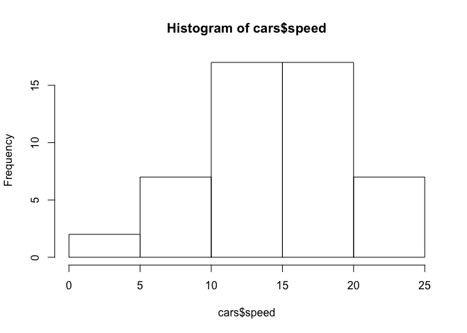
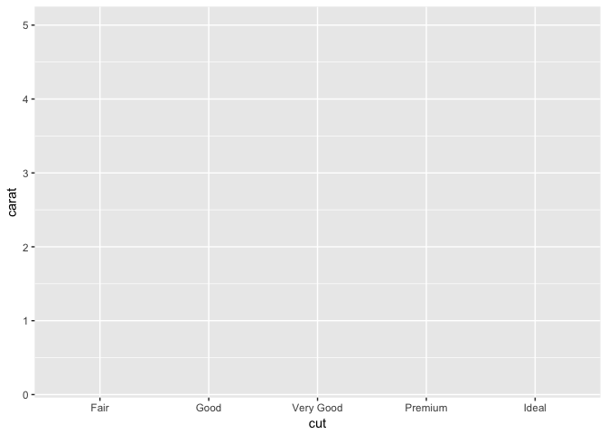
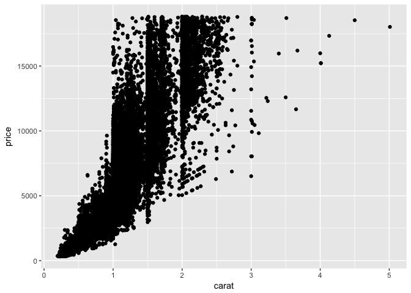
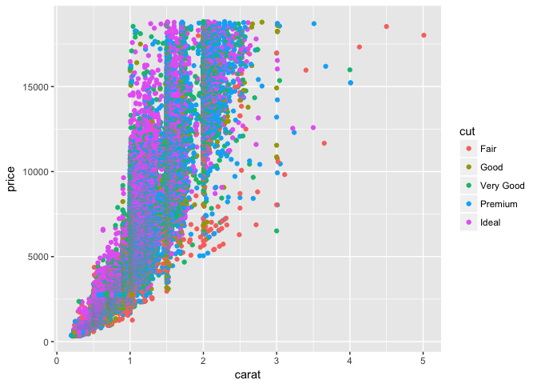
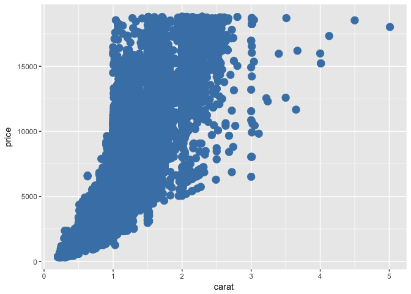
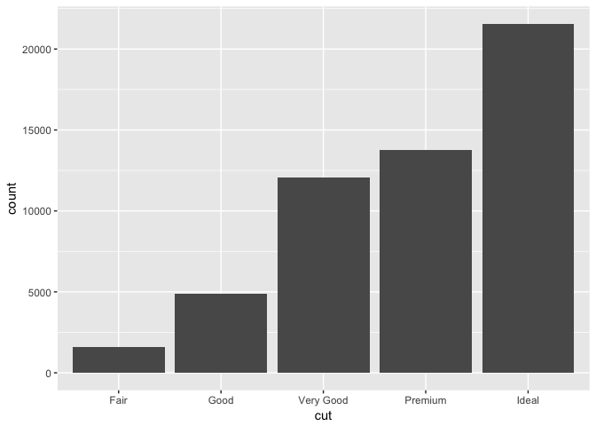

Plotting in R: ggplot2
================

INTRODUCTION TO GGPLOT2
=======================

-   Author: Lindsay Coome
-   Lesson Topic: Plotting in R using ggplot2
-   [Study Materials](https://github.com/UofTCoders/studyGroup/tree/gh-pages/lessons/r/ggplot2)

WHAT IS GGPLOT?
---------------

ggplot2 is meant to be an implementation of the Grammar of Graphics, hence gg-plot. The basic notion is that there is a grammar to the composition of graphical components in statistical graphics, and by directly controlling that grammar, you can generate a large set of carefully constructed graphics tailored to your particular needs. Each component is added to the plot as a layer.

COMPONENTS OF A GGPLOT2 PLOT
----------------------------

Plots convey information through various aspects of their aesthetics. Some aesthetics that plots use are:

-   x position
-   y position
-   size of elements
-   shape of elements
-   color of elements

The elements in a plot are geometric shapes, like

-   points
-   lines
-   line segments
-   bars
-   text

Some of these geometries have their own particular aesthetics. For instance:

**points**

-   point shape
-   point size

**lines**

-   line type
-   line weight

**bars**

-   y minimum
-   y maximum
-   fill color
-   outline color

**text**

-   label value

LET'S GET STARTED!
------------------

Here is an example of the base plotting functions in R:

``` r
plot(cars)
```


``` r
hist(cars$speed)
```



[But ggplot2 plots are prettier...](https://www.google.ca/search?q=ggplot2&client=safari&rls=en&source=lnms&tbm=isch&sa=X&ved=0ahUKEwisuv6V6IvSAhVk0oMKHTNkARkQ_AUICCgB&biw=1279&bih=621#tbm=isch&q=ggplot2+examples)

We'll investigate the dataset we're going to use to make some graphs....

``` r
library(ggplot2)
str(diamonds)
```

    ## Classes 'tbl_df', 'tbl' and 'data.frame':    53940 obs. of  10 variables:
    ##  $ carat  : num  0.23 0.21 0.23 0.29 0.31 0.24 0.24 0.26 0.22 0.23 ...
    ##  $ cut    : Ord.factor w/ 5 levels "Fair"<"Good"<..: 5 4 2 4 2 3 3 3 1 3 ...
    ##  $ color  : Ord.factor w/ 7 levels "D"<"E"<"F"<"G"<..: 2 2 2 6 7 7 6 5 2 5 ...
    ##  $ clarity: Ord.factor w/ 8 levels "I1"<"SI2"<"SI1"<..: 2 3 5 4 2 6 7 3 4 5 ...
    ##  $ depth  : num  61.5 59.8 56.9 62.4 63.3 62.8 62.3 61.9 65.1 59.4 ...
    ##  $ table  : num  55 61 65 58 58 57 57 55 61 61 ...
    ##  $ price  : int  326 326 327 334 335 336 336 337 337 338 ...
    ##  $ x      : num  3.95 3.89 4.05 4.2 4.34 3.94 3.95 4.07 3.87 4 ...
    ##  $ y      : num  3.98 3.84 4.07 4.23 4.35 3.96 3.98 4.11 3.78 4.05 ...
    ##  $ z      : num  2.43 2.31 2.31 2.63 2.75 2.48 2.47 2.53 2.49 2.39 ...

Our first graph?

``` r
ggplot(diamonds, aes(x=cut, y=carat))
```



We've defined the structure of our graph, but we need to add a "layer" to it in order to define what type of graph it is. Let's make a scatterplot:

``` r
ggplot(diamonds, aes(x=carat, y=price)) + 
  geom_point()
```


You can also save the structure of the graph to a variable and then add layers and other attributes to it. Let's do that:

``` r
g <- ggplot(diamonds, aes(x=carat, y=price))
g + geom_point()
```



We can add other "layers" of graphs to our first graph. Let's add a trend line to our scatterplot:

``` r
g + geom_point() + geom_smooth() 
```

    ## `geom_smooth()` using method = 'gam'


We can also "facet" our graphs, which means dividing a plot into subplots based on the values of one or more discrete variables.

``` r
g + geom_point() + geom_smooth() + facet_grid(cut~.)
```

    ## `geom_smooth()` using method = 'gam'


There are lots of ways to organize your facet. See "faceting" at the bottom of [ggplot cheetsheet](https://www.rstudio.com/wp-content/uploads/2015/03/ggplot2-cheatsheet.pdf).

Let's say we don't want to facet, but we want to colour the dots depending on the cut of the diamonds:

``` r
ggplot(diamonds, aes(x=carat, y=price, color=cut)) + geom_point()
```



We can also change some aesthetic features of the graph. Let's get rid of the color aspect of our structure and change the colour and size of the points:

``` r
ggplot(diamonds, aes(x=carat, y=price)) + geom_point(color="steelblue", size=4)
```



Let's look at how to change the theme and labels:

``` r
g + geom_point() +
  ylab("Diamond Price") +
  xlab("Carat") +
  ggtitle("Diamond Price by Weight") +
  theme_bw()
```


What about a bar plot? Let's find out how many diamonds of each cut are in the dataset.

``` r
ggplot(diamonds, aes(cut)) + geom_bar()
```



What about making interactive graphs in R? There is a package called plotly that lets us make our ggplot2 graphs interactive:

``` r
library(plotly)
```

    ## 
    ## Attaching package: 'plotly'

    ## The following object is masked from 'package:ggplot2':
    ## 
    ##     last_plot

    ## The following object is masked from 'package:stats':
    ## 
    ##     filter

    ## The following object is masked from 'package:graphics':
    ## 
    ##     layout

``` r
g <- ggplot(diamonds, aes(cut)) + geom_bar()
p=ggplotly(g)
p
```

<!--html_preserve-->

<script type="application/json" data-for="htmlwidget-5129380a98a1c4539eab">{"x":{"data":[{"x":[1,2,3,4,5],"y":[1610,4906,12082,13791,21551],"text":["count: 1610<br>cut: Fair","count: 4906<br>cut: Good","count: 12082<br>cut: Very Good","count: 13791<br>cut: Premium","count: 21551<br>cut: Ideal"],"key":null,"type":"bar","marker":{"autocolorscale":false,"color":"rgba(89,89,89,1)","line":{"width":1.88976377952756,"color":"transparent"}},"showlegend":false,"xaxis":"x","yaxis":"y","hoverinfo":"text","name":""}],"layout":{"margin":{"t":26.2283105022831,"r":7.30593607305936,"b":40.1826484018265,"l":54.7945205479452},"plot_bgcolor":"rgba(235,235,235,1)","paper_bgcolor":"rgba(255,255,255,1)","font":{"color":"rgba(0,0,0,1)","family":"","size":14.6118721461187},"xaxis":{"domain":[0,1],"type":"linear","autorange":false,"tickmode":"array","range":[0.4,5.6],"ticktext":["Fair","Good","Very Good","Premium","Ideal"],"tickvals":[1,2,3,4,5],"ticks":"outside","tickcolor":"rgba(51,51,51,1)","ticklen":3.65296803652968,"tickwidth":0.66417600664176,"showticklabels":true,"tickfont":{"color":"rgba(77,77,77,1)","family":"","size":11.689497716895},"tickangle":-0,"showline":false,"linecolor":null,"linewidth":0,"showgrid":true,"gridcolor":"rgba(255,255,255,1)","gridwidth":0.66417600664176,"zeroline":false,"anchor":"y","title":"cut","titlefont":{"color":"rgba(0,0,0,1)","family":"","size":14.6118721461187},"hoverformat":".2f"},"yaxis":{"domain":[0,1],"type":"linear","autorange":false,"tickmode":"array","range":[-1077.55,22628.55],"ticktext":["0","5000","10000","15000","20000"],"tickvals":[0,5000,10000,15000,20000],"ticks":"outside","tickcolor":"rgba(51,51,51,1)","ticklen":3.65296803652968,"tickwidth":0.66417600664176,"showticklabels":true,"tickfont":{"color":"rgba(77,77,77,1)","family":"","size":11.689497716895},"tickangle":-0,"showline":false,"linecolor":null,"linewidth":0,"showgrid":true,"gridcolor":"rgba(255,255,255,1)","gridwidth":0.66417600664176,"zeroline":false,"anchor":"x","title":"count","titlefont":{"color":"rgba(0,0,0,1)","family":"","size":14.6118721461187},"hoverformat":".2f"},"shapes":[{"type":"rect","fillcolor":null,"line":{"color":null,"width":0,"linetype":[]},"yref":"paper","xref":"paper","x0":0,"x1":1,"y0":0,"y1":1}],"showlegend":false,"legend":{"bgcolor":"rgba(255,255,255,1)","bordercolor":"transparent","borderwidth":1.88976377952756,"font":{"color":"rgba(0,0,0,1)","family":"","size":11.689497716895}},"barmode":"stack","hovermode":"closest"},"source":"A","config":{"modeBarButtonsToAdd":[{"name":"Collaborate","icon":{"width":1000,"ascent":500,"descent":-50,"path":"M487 375c7-10 9-23 5-36l-79-259c-3-12-11-23-22-31-11-8-22-12-35-12l-263 0c-15 0-29 5-43 15-13 10-23 23-28 37-5 13-5 25-1 37 0 0 0 3 1 7 1 5 1 8 1 11 0 2 0 4-1 6 0 3-1 5-1 6 1 2 2 4 3 6 1 2 2 4 4 6 2 3 4 5 5 7 5 7 9 16 13 26 4 10 7 19 9 26 0 2 0 5 0 9-1 4-1 6 0 8 0 2 2 5 4 8 3 3 5 5 5 7 4 6 8 15 12 26 4 11 7 19 7 26 1 1 0 4 0 9-1 4-1 7 0 8 1 2 3 5 6 8 4 4 6 6 6 7 4 5 8 13 13 24 4 11 7 20 7 28 1 1 0 4 0 7-1 3-1 6-1 7 0 2 1 4 3 6 1 1 3 4 5 6 2 3 3 5 5 6 1 2 3 5 4 9 2 3 3 7 5 10 1 3 2 6 4 10 2 4 4 7 6 9 2 3 4 5 7 7 3 2 7 3 11 3 3 0 8 0 13-1l0-1c7 2 12 2 14 2l218 0c14 0 25-5 32-16 8-10 10-23 6-37l-79-259c-7-22-13-37-20-43-7-7-19-10-37-10l-248 0c-5 0-9-2-11-5-2-3-2-7 0-12 4-13 18-20 41-20l264 0c5 0 10 2 16 5 5 3 8 6 10 11l85 282c2 5 2 10 2 17 7-3 13-7 17-13z m-304 0c-1-3-1-5 0-7 1-1 3-2 6-2l174 0c2 0 4 1 7 2 2 2 4 4 5 7l6 18c0 3 0 5-1 7-1 1-3 2-6 2l-173 0c-3 0-5-1-8-2-2-2-4-4-4-7z m-24-73c-1-3-1-5 0-7 2-2 3-2 6-2l174 0c2 0 5 0 7 2 3 2 4 4 5 7l6 18c1 2 0 5-1 6-1 2-3 3-5 3l-174 0c-3 0-5-1-7-3-3-1-4-4-5-6z"},"click":"function(gd) { \n        // is this being viewed in RStudio?\n        if (location.search == '?viewer_pane=1') {\n          alert('To learn about plotly for collaboration, visit:\\n https://cpsievert.github.io/plotly_book/plot-ly-for-collaboration.html');\n        } else {\n          window.open('https://cpsievert.github.io/plotly_book/plot-ly-for-collaboration.html', '_blank');\n        }\n      }"}],"modeBarButtonsToRemove":["sendDataToCloud"]},"base_url":"https://plot.ly"},"evals":["config.modeBarButtonsToAdd.0.click"],"jsHooks":[]}</script>
<!--/html_preserve-->
Finally, here is qplot, a way of making super quick scatterplots in R.

``` r
qplot(carat, price, data = diamonds)
```


MORE RESOURCES ON GGPLOT2
-------------------------

[ggplot2 documentation](http://had.co.nz/ggplot2/)

[Book by Hadley Wickham](https://www.amazon.com/ggplot2-Elegant-Graphics-Data-Analysis/dp/0387981403)

[ggplot2 cheat sheet](https://www.rstudio.com/wp-content/uploads/2015/03/ggplot2-cheatsheet.pdf)

[r graph gallery for inspiration (not just limited to ggplot2 graphs)](http://www.r-graph-gallery.com/all-graphs/)
